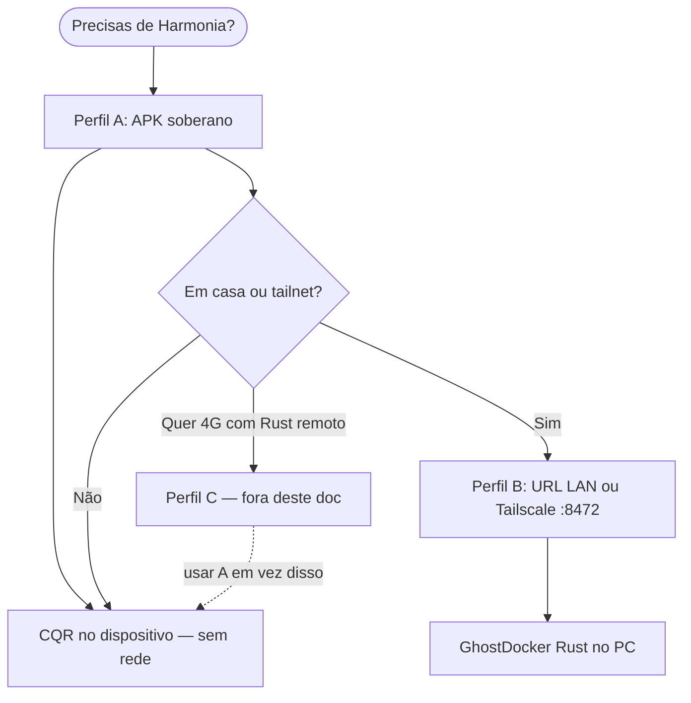

# Filosofia de deploy — Perfil A (+ B opcional)

> **Documento secundário** · Apoio a [VOID-QRC — Plano Principal](../docs/obsidian/VOID-QRC-PLANO-INDUSTRIA.md) · **Fase 3** — soberania no dispositivo

> **Modelo adoptado:** soberania no dispositivo e na casa.  
> **Fora de âmbito:** Perfil C (VPS pública, domínio na Internet, túneis tipo Cloudflare/localtunnel como base).

Este documento alinha deploy com os pilares do projeto: **soberania**, **zero identidade persistente**, **stack própria**, **GPL + tesouraria NOSTR**, **sem cloud obrigatória**.

---

## Perfil A — Soberano absoluto (base)

Tudo o que importa corre **no telemóvel** ou **na tua máquina local**, sem expor o motor CQR à Internet pública.

| Camada | O quê | Comando / config |
|--------|--------|------------------|
| Harmonia | GhostDock + Higgs + Phantom no dispositivo | `npm run android:build:sovereign` |
| Entropia / CQR | `CQR no dispositivo` (void_core + VoidAnimus) | Sem `VITE_QUANTUM_API_URL` no build |
| Relay NOSTR | Teu container | `VITE_NOSTR_RELAY_PRIMARY=ws://localhost:7777` (no PC) ou relay acessível na LAN |
| Royalties | Transparentes, comunidade | `VITE_ETRNET_TREASURY_NPUB` + `VITE_PROTOCOL_ROYALTY_BPS` |
| Bitcoin / LND | Regtest soberano (testes) | `docker compose` stack em `.env.sovereign` |
| Anchor ETH | Local / Sepolia (teste) | `npm run anchor:local` ou `anchor:sepolia`; `SKIP_PMU_ANCHOR=1` para Harmonia sem gas |
| Quântico cloud | **Não** | Sem IBM QRNG; CQR + ANU + pool local |

### Arranque mínimo (A)

```bash
# Stack local (opcional para NOSTR/LND/regtest no PC — não obrigatória para APK soberano)
docker compose --env-file .env.sovereign -f docker-compose.sovereign.yml up -d

# APK — Harmonia offline no telemóvel
npm run android:build:sovereign
# Instalar: adb install -r android/app/build/outputs/apk/debug/app-debug.apk
# ou copiar o APK manualmente
```

No telemóvel: **Compute → Harmonia Cósmica** → modo **CQR no dispositivo**. Sem URL remota, sem PC ligado.

**Phantom Harvester → ScrapScanner:** varredura directa (Telegram, X/Nitter, exchanges, vCard) no VOID — `npm run scrapscanner` na CLI com o mesmo núcleo.

### Variáveis alinhadas (`.env.sovereign` / build)

```bash
VITE_COSMIC_SOVEREIGN=true
# Não definir VITE_QUANTUM_API_URL no build soberano

VITE_NOSTR_RELAY_PRIMARY=ws://localhost:7777
VITE_NOSTR_RELAY_FALLBACK=wss://relay.damus.io   # só emergência

VITE_ETRNET_TREASURY_NPUB=npub1...
VITE_PROTOCOL_ROYALTY_BPS=10

BITCOIN_NETWORK=regtest
VITE_BITCOIN_NETWORK=regtest
```

---

## Perfil B — Soberano em rede (extra opcional)

**Sobre o Perfil A:** quando estás em casa (ou numa **tailnet** privada), o telemóvel pode usar o **GhostDocker Rust** do teu PC — ainda **sem** Internet pública, **sem** VPS, **sem** túnel comercial.

| Camada | O quê | Notas |
|--------|--------|--------|
| Motor CQR | `quantum-engine` no PC | `npm run stack:up:harmony` |
| Ligação | Wi‑Fi LAN ou Tailscale/WireGuard | IP privado (`192.168.x.x` ou `100.x.x.x`) |
| APK | Soberano + URL no painel **ou** `android:build:lan` | Preferir **HTTP :8472** na LAN se TLS interno chatear |
| Exposição | **Nunca** port forward 9443/8472 para a Internet | Router fechado = alinhado com a filosofia |

### Quando usar B

- Queres **void-runner Rust** no telemóvel (mais forte que só WASM no WebView).
- O PC está na mesma rede ou na **mesma tailnet** que o telemóvel.
- Aceitas que, fora de casa/tailnet, voltas ao **Perfil A** no dispositivo.

### Arranque (B em cima de A)

```bash
# PC — motor CQR + void-runner (já validado)
npm run stack:up:harmony
curl -s http://127.0.0.1:8472/health

# IP LAN (exemplo)
ip -4 -o addr show scope global | awk '{print $4}' | cut -d/ -f1 | head -1
```

**Telemóvel (recomendado — mantém A como base):**

1. APK **soberano** (`android:build:sovereign`).
2. **Harmonia → Motor CQR remoto** → `http://192.168.15.136:8472` (troca pelo teu IP).
3. **GUARDAR → TESTAR**. Em casa usa Rust; longe apaga URL ou **LOCAL** → volta CQR no dispositivo.

**Alternativa:** APK com URL LAN embutida:

```bash
npm run android:build:lan
# https://<IP-LAN>:9443 — só na mesma Wi‑Fi
```

### Tailnet (B+, ainda sem Perfil C)

| Ferramenta | Licença | Uso |
|------------|---------|-----|
| **WireGuard** | GPL | Rede manual |
| **Headscale** | OSS | Coordenação Tailscale self-hosted |
| **Tailscale** (plano pessoal grátis) | Cliente fechado | Mais simples; tráfego entre *teus* dispositivos |

URL no painel: `http://100.x.x.x:8472` (IP Tailscale do PC com `stack:up:harmony`).

---

## O que **não** faz parte deste modelo (Perfil C — excluído)

Não é “proibido” no código — é **fora da doutrina** de deploy que escolheste:

| Prática | Porquê fica de fora |
|---------|---------------------|
| VPS pública (Oracle, etc.) | Infra noutro sítio; soberania parcial |
| `npm run cqr:tunnel` / Cloudflare / localtunnel como base | Tráfego por terceiro; URL efémera |
| `android:build:remote -- https://dominio público` | APK preso a endpoint na Internet |
| Port forward no router (9443 → PC) | Expõe CQR ao mundo |
| DuckDNS + Let's Encrypt na casa para 4G | É Perfil C “light”; não é A+B |

Para testar 4G **sem** Perfil C: usa **Perfil A** no telemóvel (CQR no dispositivo). O Rust do PC fica para quando estás em casa/tailnet (B).

Documentação legada com túneis/VPS: [ANDROID-REMOTE.md](./ANDROID-REMOTE.md), secção VPS em [DEPLOY-PRODUCTION.md](./DEPLOY-PRODUCTION.md) — referência técnica, não o caminho filosófico A+B.

---

## Mapa de decisão



---

## Checklist A + B (grátis / OSS)

- [ ] `npm run android:build:sovereign` + APK no telemóvel
- [ ] Harmonia em modo **CQR no dispositivo** validada offline
- [ ] (Opcional B) `npm run stack:up:harmony` no PC
- [ ] (Opcional B) URL `http://<IP-LAN-ou-100.x>:8472` no painel ou `android:build:lan`
- [ ] Relay NOSTR local no compose; fallback público só emergência
- [ ] `VITE_ETRNET_TREASURY_NPUB` se quiseres royalties activos
- [ ] Regtest + LND Docker para pagamentos de teste
- [ ] **Não** abrir portas CQR no router; **não** depender de túnel/VPS

```bash
npm run production:preflight
# CQR online só relevante se estiveres no Perfil B naquele momento
```

---

## Resumo

| Perfil | Papel |
|--------|--------|
| **A** | Identidade do deploy — telemóvel autónomo |
| **B** | Extra em casa/tailnet — Rust no PC quando convém |
| **C** | Não adoptado — Internet pública / VPS / túneis |

**Frase-guia:** *Soberano no bolso; Rust no PC só na tua rede privada; nada de publicar o CQR ao mundo.*
