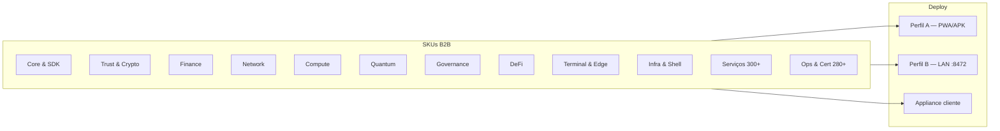

> **Documento secundário** · Apoio a [VOID-QRC — Plano Principal](./obsidian/VOID-QRC-PLANO-INDUSTRIA.md) · **Fase 4** — linhas B2B

# Linhas de produto B2B — ET-COSMIC (catálogo completo)

> **Princípio:** nenhum módulo do monorepo fica de fora. Cada painel, runtime, contrato e script mapeia para **pelo menos um SKU B2B**.  
> **Filosofia de deploy:** alinhado com [DOC/FILOSOFIA-DEPLOY.md](../DOC/FILOSOFIA-DEPLOY.md) — Perfil A (dispositivo), B (LAN/tailnet), appliance on-prem do cliente; **sem** SaaS multi-tenant público obrigatório.  
> **Arquitetura:** [ARCH-EVOLUTION.md](./ARCH-EVOLUTION.md)

---

## 1. Visão geral

O ET-COSMIC é **uma plataforma** vendável como **180+ SKUs** (produtos atómicos + bundles + infra + serviços). Um cliente B2B compra **1..N produtos**; o build Vite filtra rotas por `VITE_B2B_SKUS` e inclui **apenas** os `import()` dinâmicos dos painéis activos (`virtual:b2b-panel-loaders`).



### Legenda de deploy

| Símbolo | Significado |
|---------|-------------|
| **A** | Só dispositivo (PWA/APK soberano, WASM local) |
| **B** | Perfil B — PC na LAN/tailnet (`stack:up:harmony`, `:8472`) |
| **VPS** | Appliance Docker no hardware do cliente (ou bare metal) |
| **SDK** | Biblioteca `@eternet/core` / npm, sem UI |
| **Real** | `panelTiers`: production |
| **Real+** | `panelTiers`: real_plus (rede/LND/relay/hardware) |

---

## 2. Infraestrutura transversal (produtos 00–09)

Estes **não são painéis** — são a base que outros SKUs embutem ou referenciam.

| SKU | Nome comercial | Código / artefacto | Deploy | Notas |
|-----|----------------|-------------------|--------|-------|
| **VOID-00** | **Core WASM** | `void_core/`, `void_core/pkg/*.wasm` | SDK, A, B | ML-KEM, ML-DSA, QEL, Bulletproofs, Blake3; **handshake licença** ([VOID-00-LICENSE-HANDSHAKE.md](./VOID-00-LICENSE-HANDSHAKE.md)) |
| **VOID-01** | **TypeScript SDK** | `eternet_ts/` → `@eternet/core` | SDK | Integração RE-trolab, terceiros |
| **VOID-02** | **void-runner** | `void_runner/` | B, VPS | MapReduce WASM, wasmtime sandbox |
| **VOID-03** | **Quantum Engine** | `quantum/`, `Dockerfile.quantum` | B, VPS | CQR, quimb, BB84, Penrose |
| **VOID-04** | **Express Gateway** | `server/server.js` | VPS | Proxy LND, Nostr, APIs |
| **VOID-05** | **Sovereign Stack** | `docker-compose.sovereign.yml` | VPS | bitcoind, LND, relay, quantum profile |
| **VOID-06** | **Anchor Contracts** | `contracts/`, `ETRNETAnchor.sol` | VPS | Sepolia/local, auditoria PMU |
| **VOID-07** | **Android Shell** | `android/`, Capacitor | A | APK soberano / LAN |
| **VOID-08** | **PWA Sovereign** | `npm run pwa:serve:sovereign` | A | Build `--mode sovereign` |
| **VOID-09** | **Arquivo R&D Teoria** | `docs/archive/bruno-theory/` | SDK | Teoria FURC/HMCO/DTU — licença research |
| **VOID-0A** | **pi_worker WASM** | `void_runner/pi_worker.wasm` | B, VPS | Carga MapReduce de referência |
| **VOID-0B** | **RE-trolab Bridge** | `eternet_ts`, integração ARCH-EVOLUTION §4 | SDK | IDE / emulador parceiro |
| **VOID-0C** | **Specs & Whitepaper Pack** | `whitepaper.pdf`, `docs/master-sku-list.pdf`, `public/*.pdf` | A, licença | Whitepaper v1.2 + catálogo SKU PDF |
| **VOID-0D** | **Rust Workspace** | `Cargo.toml`, workspace root | SDK | void_core + void_runner unificados |
| **VOID-0E** | **Production Docker Image** | `Dockerfile.production`, `npm run production:docker` | VPS | Frontend + server empacotado |
| **VOID-0F** | **Nginx Sovereign Proxy** | `docker-compose` nginx, `DOC/DEPLOY-PRODUCTION.md` | VPS | Same-origin Perfil B |

---

## 3. Home & hub (produtos 10–12)

| SKU | Nome | Rotas | Código | Deploy | Tier |
|-----|------|-------|--------|--------|------|
| **VOID-10** | **Dashboard Hub** | `/dashboard` | `EternetDashboard.tsx` | A, B | Real |
| **VOID-11** | **VOID Messenger** | `/messenger` | `Messenger.tsx`, GhostID, QEL | A | Real |
| **VOID-12** | **Phantom Harvester** | `/harvester` | `PhantomHarvesterPanel`, `scrapscanner.mjs` | A, B, VPS | Real+ |
| **VOID-13** | **Landing & Marketing Shell** | `/` (App home) | `Marquee`, `Guarantees`, `Roadmap`, `Footer` | A | Real |
| **VOID-14** | **Onboarding Flow** | fluxo inicial | `Onboarding.tsx`, `App.tsx` | A | Real |
| **VOID-15** | **GhostID Setup Widget** | embutido em painéis | `GhostIDSetup.tsx` | A | Real |
| **VOID-16** | **Dev Setup Banner** | global dev | `DevSetupBanner.tsx` | A, B | Real |
| **VOID-17** | **Panel Tier Badges** | todos os painéis | `PanelTierBadge`, `panelTiers.ts` | A | Real |
| **VOID-18** | **Network Simulation Core** | Distance Bridge | `NetworkSimCore.tsx` | A | Real |

---

## 4. Cripto & identidade (produtos 20–26)

| SKU | Nome | Rotas | Código | Deploy | Tier |
|-----|------|-------|--------|--------|------|
| **VOID-20** | **ZKP Studio** | `/crypto/zkp` | `ZKPLab`, `zkp.ts` | A, SDK | Real |
| **VOID-21** | **GhostID & VPN** | `/crypto/ghostid` | `GhostVPNPanel`, `ghostid.ts` | A | Real |
| **VOID-22** | **PQC Enterprise** | `/crypto/pqc` | `PqcDeveloperDashboard`, void_core PQC | A, SDK | Real |
| **VOID-23** | **CQR→PQC Bridge** | `/crypto/cqr-pqc` | `CQRPqcPanel`, `quantumBridge.ts` | A, B | Real |
| **VOID-24** | **Crypto Testament** | `/crypto/testament` | `CryptoTestamentLab` | A | Real |
| **VOID-25** | **Karma Wallet** | `/crypto/karma` | `KarmaWallet`, `karmaSystem.ts` | A | Real |
| **VOID-26** | **Trust Bundle** | 20–25 + 11 + 95 | AMP + Messenger + PQC | A | Bundle |

---

## 5. Finanças (produtos 30–38)

| SKU | Nome | Rotas | Código | Deploy | Tier |
|-----|------|-------|--------|--------|------|
| **VOID-30** | **DEX Order Book** | `/finance/dex` | `DEXPanel` | B, VPS | Real+ |
| **VOID-31** | **Chimera Dark Pool** | `/finance/chimera` | `ChimeraExchangePanel` | B, VPS | Real+ |
| **VOID-32** | **Nostr DEX** | `/finance/nostr-dex` | `NostrDEXPanel` | B, VPS | Real+ |
| **VOID-33** | **Stablecoin Engine** | `/finance/stablecoin` | `StablecoinPanel` | B, VPS | Real+ |
| **VOID-34** | **RWA Tokenization** | `/finance/rwa` | `RwaTokenizationPanel` | B, VPS | Real+ |
| **VOID-35** | **Sovereign Pools** | `/finance/pools` | `SovereignPoolsPanel` | B, VPS | Real+ |
| **VOID-36** | **Janus Finance** | `/finance/janus` | `JanusFinancePanel` | B, VPS | Real+ |
| **VOID-37** | **Payment Gateway** | `/finance/payment` | `PaymentGatewayPanel`, LND/NWC | VPS | Real+ |
| **VOID-38** | **Collapse Finance** | `/finance/collapse` | `CollapseFinancePanel`, `collapse/` | A, B | Real |
| **VOID-39** | **Finance Full Stack** | 30–38 | `docker-compose` + VOID-05 | VPS | Bundle |

---

## 6. Rede (produtos 40–45)

| SKU | Nome | Rotas | Código | Deploy | Tier |
|-----|------|-------|--------|--------|------|
| **VOID-40** | **Distance Bridge** | `/network/distance` | `DistanceBridge`, BLE/LoRa/WebRTC | A, hardware | Real+ |
| **VOID-41** | **Parasitic Architecture** | `/network/parasitic` | `ParasiticArchitecture` | A, hardware | Real+ |
| **VOID-42** | **EcoNet** | `/network/echonet` | `EcoNetPanel` | A, B | Real |
| **VOID-43** | **Nostr Sync Mesh** | `/network/mesh` | `NostrSyncPanel` | B, VPS | Real+ |
| **VOID-44** | **Acoustic Handshake** | `/network/acoustic` | `AcousticHandshakePanel` | A, hardware | Real+ |
| **VOID-45** | **Supply Chain Security** | `/network/supply-chain` | `SupplyChainSecurity` | A, B | Real |
| **VOID-46** | **Network Edge Bundle** | 40–45 | Capacitor + relay | A/B | Bundle |

---

## 7. Compute (produtos 50–61)

| SKU | Nome | Rotas | Código | Deploy | Tier |
|-----|------|-------|--------|--------|------|
| **VOID-50** | **Mirage Enclaves** | `/compute/mirage` | `MirageComputePanel` | B, VPS | Real |
| **VOID-51** | **HGPU Visualizer** | `/compute/hgpu` | `HGPUVisualizer` | A, B | Real |
| **VOID-52** | **vHGPU Farm** | `/compute/vhgpu` | `VhgpuFarmPanel`, plugins Lua | B, VPS | Real |
| **VOID-53** | **PMU vHGPU Cores** | `/compute/pmu-vhgpu` | `PmuVhgpuCoresPanel`, `pmuVhgpuScheduler` | B, VPS | Real |
| **VOID-54** | **Bruno Theory Engine** | `/compute/bruno-theory` | `src/theory/*`, `brunoTheoryEngine` | A, SDK | Real |
| **VOID-55** | **PMU Truth Ω** | `/compute/pmu-truth` | `PmuTruthOmegaPanel`, `pmuTruthLevels` | A, B | Real |
| **VOID-56** | **PMU Roadmap & Anchor** | `/compute/pmu-roadmap` | `PmuRoadmapPanel`, `pmu-audit.mjs` | B, VPS | Real |
| **VOID-57** | **Cosmic Harmonia** | `/compute/cosmic-harmony` | `cosmicVoidOrchestrator` | A, B | Real |
| **VOID-58** | **PMU Truth Omega** | `/compute/pmu-truth` | `PmuTruthOmegaPanel` | B, VPS | Real |
| **VOID-59** | **PMU Roadmap** | `/compute/pmu-roadmap` | `PmuRoadmapPanel` | B, VPS | Real |
| **VOID-60** | **Omega Layer** | `/compute/omega` | `Omega.tsx`, `wasmDeepResearch` | A, B | Real |
| **VOID-61** | **HGPU Compute** | `/compute/hgpu-compute` | `HGPUComputePanel`, `hgpuResearch` | B, VPS | Real |
| **VOID-62** | **Compute Appliance** | 50–61 + 02 + 58 | void-runner + Harmonia | VPS | Bundle |

---

## 8. Quantum (produtos 70–80)

| SKU | Nome | Rotas | Código | Deploy | Tier |
|-----|------|-------|--------|--------|------|
| **VOID-70** | **LSC Engine** | `/quantum/lsc` | `lscEngine.ts`, `LSCPanel` | A, SDK | Real |
| **VOID-71** | **QRC Topology** | `/quantum/qrc` | `QRCTopologyPanel` | A | Real |
| **VOID-72** | **Paleo Engine** | `/quantum/paleo` | `PaleoPanel` | A, B | Real |
| **VOID-73** | **Collapse Algebra** | `/quantum/collapse` | `CollapseAlgebraPanel`, `collapseAlgebra.ts` | A | Real |
| **VOID-74** | **Anacroclastia Lab** | `/quantum/anacroclastia` | `AnacroclastiaPanel` | A | Real |
| **VOID-75** | **Nostr Oracle** | `/quantum/oracle` | `NostrOraclePanel` | B, VPS | Real+ |
| **VOID-76** | **QRNG Service** | `/quantum/qrng` | `QRNGPanel`, `quantum/` | B, VPS | Real+ |
| **VOID-77** | **QR Stocks** | `/quantum/qrstocks` | `QRStocksPanel` | A, B | Real |
| **VOID-78** | **Heptary Quantum** | `/quantum/heptary` | `HeptaryQuantumPanel` | A, B | Real |
| **VOID-79** | **AQRE Monitor** | `/quantum/aqre` | `AQREPanel` | B, VPS | Real+ |
| **VOID-80** | **LUSUS Terminal** | `/quantum/lusus` | `LUSUSTerminalPanel` | B, VPS | Real+ |
| **VOID-81** | **CQR Entropy Gateway** | 76 + 03 + 23 | `Dockerfile.quantum`, API :8472 | VPS, B | Bundle |

---

## 9. Governance & ética (produtos 90–96)

| SKU | Nome | Rotas | Código | Deploy | Tier |
|-----|------|-------|--------|--------|------|
| **VOID-90** | **Quantum DAO** | `/governance/dao` | `QuantumDaoPanel` | B, VPS | Real+ |
| **VOID-91** | **Anti-Sybil Lab** | `/governance/anti-sybil` | `AntiSybilLab`, void_core PoW | A | Real |
| **VOID-92** | **Double-Spend Defense** | `/governance/double-spend` | `DoubleSpendDefenseLab` | A | Real |
| **VOID-93** | **Temporal Oracle** | `/governance/temporal` | `TemporalOracleLab` | A, B | Real |
| **VOID-94** | **Social Recovery** | `/governance/social-recovery` | `SocialRecoveryPanel` | A | Real |
| **VOID-95** | **Consent & AMP (CGF)** | `/governance/consent` | `ConsentContractPanel`, `useAmpConsent` | A | Real |
| **VOID-96** | **Sovereignty & Royalties** | `/governance/sovereignty` | `SovereigntyPanel`, GPL/NOSTR treasury | A | Real |
| **VOID-97** | **Governance Suite** | 90–96 | DAO + consent obrigatório | A/B | Bundle |

---

## 10. DeFi & vaults (produtos 100–104)

| SKU | Nome | Rotas | Código | Deploy | Tier |
|-----|------|-------|--------|--------|------|
| **VOID-100** | **Phantom Shopper** | `/defi/phopper` | `PhantomShopperPanel` | B, VPS | Real+ |
| **VOID-101** | **Aegis Vault** | `/defi/aegis` | `AegisVaultPanel` | A, B | Real |
| **VOID-102** | **Paleo Yield** | `/defi/yield` | `PaleoYieldPanel` | A, B | Real |
| **VOID-103** | **Ghost Locker** | `/defi/ghost-locker` | `GhostLockerPanel` | A | Real |
| **VOID-104** | **PoW Faucet** | `/defi/faucet` | `PoWFaucetPanel` | B, VPS | Real |

---

## 11. Terminal, privacidade & mineração (produtos 110–122)

| SKU | Nome | Rotas | Código | Deploy | Tier |
|-----|------|-------|--------|--------|------|
| **VOID-110** | **Active Terminal** | `/terminal/active` | `ActiveTerminal.tsx` | A, B | Real |
| **VOID-111** | **Symbiont Inoculator** | `/terminal/symbiont` | `SymbiontInoculator` | B, VPS | Real+ |
| **VOID-112** | **Lua Plugin Runtime** | `/terminal/lua` | `LuaPluginPanel`, `quantum/plugins/*.lua` | B, VPS | Real+ |
| **VOID-113** | **Watchtower** | `/terminal/watchtower` | `WatchtowerPanel` | B, VPS | Real+ |
| **VOID-114** | **Sphinx Mixnet** | `/terminal/sphinx` | `SphinxMixnetPanel` | B, VPS | Real+ |
| **VOID-115** | **Differential Core** | `/terminal/differential` | `DifferentialCorePanel` | A | Real |
| **VOID-116** | **Mining (CPU)** | `/terminal/mining` | `MiningPanel` | B, VPS | Real+ |
| **VOID-117** | **GPU Mining** | `/terminal/gpu-mining` | `GPUMiningPanel` | B, VPS | Real+ |
| **VOID-118** | **Homotopy Mining** | `/terminal/homotopy` | `HomotopyMiningPanel` | A, B | Real |
| **VOID-119** | **Ghost Mailbox** | `/terminal/ghost-mailbox` | `GhostMailboxPanel` | A | Real |
| **VOID-120** | **Octree SDF** | `/terminal/octree` | `OctreeSDFPanel` | A | Real |
| **VOID-121** | **Social Fabric** | `/terminal/social` | `SocialFabricPanel`, `SocialFabric` | A | Real |
| **VOID-122** | **Glossary & Docs Hub** | `/terminal/glossary` | `Glossary.tsx` | A | Real |
| **VOID-125** | **SKU Cosmos Hub** | `/lab/sku-cosmos` | `SkuEcosystemPanel.tsx` | A | Real |

---

## Era IMC — adaptação de catálogo

Todos os SKUs com rotas legadas `/quantum/*` e `/defi/*` são migrados automaticamente para `/lab/*` e `/vault/*` ao gerar `skuCatalog.generated.ts` (`npm run b2b:generate-catalog`). Mapa visual: **`/lab/sku-cosmos`**. Ver `docs/SKU-ECOSYSTEM-IMC.md`.

---

## 12. Shell futuro — OS / Browser Animus (produtos 130–133)

Visão de **camada 7** sobre todos os SKUs (sem substituir nenhum).

| SKU | Nome | Inclui | Descrição |
|-----|------|--------|-----------|
| **VOID-130** | **VOID Shell** | Todos os hubs `router.tsx` | Launcher fullscreen; barra com `C_ε`, `κ`, `Ω` (Bruno Theory) |
| **VOID-131** | **VOID Browser** | PWA + SLCC + AMP | Navegador soberano; consentimento por origem |
| **VOID-132** | **Animus IA Filosófica** | Harmonia + Theory + AMP | Agente que **explica estado causal** (métricas), não chat genérico |
| **VOID-133** | **VOID OS Appliance** | VOID-05 + 08 + 130–132 | ISO/kiosk: Docker sovereign + PWA + tailnet |

Integração técnica já existente:
- `runBrunoTheorySimulation()` → estado global UI
- `cosmicVoidOrchestrator` → ciclo Harmonia
- `ensureSovereignAmpConsent()` → ética antes de IA/ações

---

## 13. Cripto — módulos atómicos (produtos 140–159)

Desdobramento dos motores por trás dos painéis `/crypto/*` e Messenger.

| SKU | Nome | Código | Deploy | Tier |
|-----|------|--------|--------|------|
| **VOID-140** | **QEL Shamir Fragmentation** | `crypto/qel.ts` | A, SDK | Real |
| **VOID-141** | **Double Ratchet E2EE** | `crypto/doubleRatchet.ts` | A, SDK | Real |
| **VOID-142** | **UTXO Confidencial** | `crypto/utxo.ts`, Bulletproofs | A, SDK | Real |
| **VOID-143** | **Entropy Orchestrator** | `crypto/entropyOrchestrator.ts` | A, B | Real |
| **VOID-144** | **Secure Random Facade** | `utils/secureRandom.ts` | A, SDK | Real |
| **VOID-145** | **Steganography Layer** | `crypto/steganography.ts` | A | Real |
| **VOID-146** | **Fuzzy Extractor (bio)** | `crypto/fuzzyExtractor.ts` | A | Real |
| **VOID-147** | **Signing Keys Vault** | `crypto/signingKeys.ts` | A | Real |
| **VOID-148** | **Matchmaker Protocol** | `crypto/matchmaker.ts` | B, VPS | Real+ |
| **VOID-149** | **Topology Tracker** | `crypto/topologyTracker.ts` | A, B | Real |
| **VOID-150** | **GF(256) Primitives** | `crypto/gf256.ts` | SDK | Real |
| **VOID-151** | **ZK Compressor** | `crypto/zkCompressor.ts` | SDK | Real |
| **VOID-152** | **Local CQR Engine** | `lib/localCqrEngine.ts` | A | Real |
| **VOID-153** | **Remote CQR Config** | `lib/remoteCqrConfig.ts` | B | Real+ |
| **VOID-154** | **Anti-Higgs Shield** | `crypto/antiHiggs.ts` | A, B | Real |
| **VOID-155** | **Singularity Harvester** | `crypto/singularityHarvester` (tests + motor) | B, VPS | Real+ |
| **VOID-156** | **UTU Token Registry** | `crypto/utuTokens.ts` | A, B | Real |
| **VOID-157** | **LDK Lightning Bridge** | `crypto/ldkBridge.ts`, `ldkChannelFacade.ts` | VPS | Real+ |
| **VOID-158** | **NWC Interop** | `crypto/nwcProtocol.ts`, scripts NWC | VPS | Real+ |
| **VOID-159** | **Crypto Primitives Bundle** | 140–158 | SDK completo | Bundle |

---

## 14. Protocolo AMP & ética (produtos 160–174)

| SKU | Nome | Código | Deploy | Tier |
|-----|------|--------|--------|------|
| **VOID-160** | **AMP Pipeline** | `protocol/amp/ampPipeline.ts` | A, B | Real |
| **VOID-161** | **SLCC Consent Layer** | `protocol/amp/slcc.ts` | A | Real |
| **VOID-162** | **Consent Receipt Store** | `protocol/amp/consentReceiptStore.ts` | A | Real |
| **VOID-163** | **Consent Lattice** | `protocol/amp/consentLattice.ts` | A, SDK | Real |
| **VOID-164** | **CGF Consent Contract** | `ethics/consentContract.ts` | A | Real |
| **VOID-165** | **PMU Ω Pipeline** | `protocol/amp/pmuOmegaPipeline.ts` | B, VPS | Real |
| **VOID-166** | **PMU Compute Orchestrator** | `protocol/amp/pmuComputeOrchestrator.ts` | B, VPS | Real |
| **VOID-167** | **vHGPU AMP Client** | `protocol/amp/vhgpuClient.ts` | B, VPS | Real |
| **VOID-168** | **Recursive STARK (AMP)** | `protocol/amp/recursiveStark.ts` | B, VPS | Real+ |
| **VOID-169** | **LDK WASM Bridge** | `protocol/amp/ldkWasmBridge.ts` | A, B | Real+ |
| **VOID-170** | **Known Limitations Registry** | `protocol/amp/knownLimitations.ts` | A | Real |
| **VOID-171** | **Protocol Royalty** | `protocol/sovereignty/protocolRoyalty.ts` | A | Real |
| **VOID-172** | **Core Consent Hook** | `hooks/useCoreConsent.ts` | A | Real |
| **VOID-173** | **Sovereign Config** | `config/sovereign.ts`, `lib/cosmicSovereignMode.ts` | A | Real |
| **VOID-174** | **AMP Enterprise Bundle** | 160–173 + 95 | Governança completa | Bundle |

---

## 15. Harvesters & inteligência (produtos 180–189)

| SKU | Nome | Código | Deploy | Tier |
|-----|------|--------|--------|------|
| **VOID-180** | **ScrapScanner Core** | `harvesters/scrapScanner.ts` | A, CLI | Real+ |
| **VOID-181** | **ScrapScanner CLI** | `harvesters/scrapScannerCli.ts`, `scripts/scrapscanner.mjs` | VPS, CLI | Real+ |
| **VOID-182** | **Telegram Scraper** | `harvesters/social/telegramScraper.ts` | A, B | Real+ |
| **VOID-183** | **Binance Scraper** | `harvesters/exchanges/binanceScraper.ts` | B, VPS | Real+ |
| **VOID-184** | **Mercado Bitcoin Scraper** | `harvesters/exchanges/mercadoBitcoinScraper.ts` | B, VPS | Real+ |
| **VOID-185** | **Phantom Harvest Harmony** | `harvesters/phantomHarvestHarmony.ts` | A, B | Real+ |
| **VOID-186** | **Contact Directory** | `storage/contactDirectory.ts` | A | Real |
| **VOID-187** | **vCard / export pipeline** | harvester exports | A | Real+ |
| **VOID-188** | **Exchange Intel Bundle** | 183–184 + 12 | Corretoras BR/global | Bundle |
| **VOID-189** | **Social Harvest Bundle** | 180–182 + 186 | Telegram + contacts | Bundle |

---

## 16. VPS, GhostDock & Harmonia backends (produtos 190–199)

| SKU | Nome | Código | Deploy | Tier |
|-----|------|--------|--------|------|
| **VOID-190** | **GhostDocker Bridge** | `vps/ghostDockerBridge.ts` | B, LAN :8472 | Real+ |
| **VOID-191** | **void-runner Client** | `vps/voidRunnerClient.ts`, `voidRunnerBridge.ts` | B, VPS | Real+ |
| **VOID-192** | **Phantom Pipeline VPS** | `vps/phantomPipeline.ts` | VPS | Real+ |
| **VOID-193** | **HiggsGit Sync** | `vps/higgsGit.ts` | B, VPS | Real+ |
| **VOID-194** | **GhostDock Core** | `core/ghostDock.ts` | A, B | Real |
| **VOID-195** | **EcoNet VPS Module** | `vps/ecoNet.ts` | VPS | Real |
| **VOID-196** | **Harmonia CLI** | `scripts/cosmic-harmony.mjs` | VPS, CI | Real |
| **VOID-197** | **Harmonia VPS Script** | `scripts/cosmic-harmony-vps.sh` | VPS | Real+ |
| **VOID-198** | **build-vps.sh Appliance** | `scripts/build-vps.sh` | VPS | Real+ |
| **VOID-199** | **Perfil B LAN Bundle** | 190–191 + 03 + 05 | PC casa + telemóvel | Bundle |

---

## 17. Storage, CRDT & mensagens (produtos 200–209)

| SKU | Nome | Código | Deploy | Tier |
|-----|------|--------|--------|------|
| **VOID-200** | **Chat Store E2EE** | `storage/chatStore.ts` | A | Real |
| **VOID-201** | **Channel Store** | `storage/channelStore.ts` | A, B | Real |
| **VOID-202** | **HCN Store** | `storage/hcnStore.ts` | A, hardware | Real+ |
| **VOID-203** | **G-Counter CRDT** | `crdt/gCounterCrdt.ts` | A, B | Real |
| **VOID-204** | **UTXO Store** | `storage/utxoStore` (refs) | A | Real |
| **VOID-205** | **Messaging Data Bundle** | 200–204 + 141 | Messenger backend | Bundle |

---

## 18. Rede — drivers & transporte (produtos 210–219)

| SKU | Nome | Código | Deploy | Tier |
|-----|------|--------|--------|------|
| **VOID-210** | **Native Bridge (Capacitor)** | `network/NativeBridge.ts` | A, Android | Real |
| **VOID-211** | **ETRNET Nostr Kinds** | `network/etrnetKinds.ts` | B, VPS | Real+ |
| **VOID-212** | **Relay Health Probe** | `network/relayProbe.ts`, `scripts/relay-health.*` | VPS | Real+ |
| **VOID-213** | **Lightning+Nostr Transport** | `network/lightningNostrTransport.ts` | VPS | Real+ |
| **VOID-214** | **Local Drivers (BLE/serial)** | `network/localDrivers.ts` | A, hardware | Real+ |
| **VOID-215** | **Acoustic Driver** | `network/acousticDriver.ts`, `crypto/acousticHandshake.ts` | A, hardware | Real+ |
| **VOID-216** | **Distance Bridge Core** | `network/distanceBridge.ts` | A, B | Real+ |
| **VOID-217** | **Mesh Preflight** | `scripts/mesh-preflight.sh` | VPS | Real+ |
| **VOID-218** | **CQR Tunnel Quick** | `scripts/cqr-tunnel-quick.sh` | B | Real+ |
| **VOID-219** | **Mesh Transport Bundle** | 211–213 + 43 | Nostr + Lightning | Bundle |

---

## 19. Quantum — plugins & motores (produtos 230–244)

| SKU | Nome | Código | Deploy | Tier |
|-----|------|--------|--------|------|
| **VOID-230** | **Lua: LSC Monitor** | `quantum/plugins/lsc_monitor.lua` | VPS | Real |
| **VOID-231** | **Lua: vHGPU Farm** | `quantum/plugins/vhgpu_farm.lua` | VPS | Real |
| **VOID-232** | **Lua: Ghost Strategy** | `quantum/plugins/ghost_strategy.lua` | VPS | Real |
| **VOID-233** | **Lua: Collapse Strategy** | `quantum/plugins/collapse_strategy.lua` | VPS | Real |
| **VOID-234** | **Lua: Homotopy Validator** | `quantum/plugins/homotopy_validator.lua` | VPS | Real |
| **VOID-235** | **Quantum Switch** | `qrc/quantumSwitch.ts` | A, SDK | Real |
| **VOID-236** | **WebGPU Tensor Engine** | `qrc/webgpuTensorEngine.ts` | A, B | Real |
| **VOID-237** | **AQRE Client** | `lib/aqreClient.ts` | B, VPS | Real+ |
| **VOID-238** | **LUSUS Client** | `lib/lususClient.ts` | B, VPS | Real+ |
| **VOID-239** | **Anacróclastic Limits** | `lib/anacrocasticLimits.ts` | A, SDK | Real |
| **VOID-240** | **Paleo Entropy Fossil** | `paleo/paleoEntropyFossil.ts` | A, B | Real |
| **VOID-241** | **BB84 / Penrose (Python)** | `quantum/` simulators | VPS | Real+ |
| **VOID-242** | **PMU Domain Compute (Py)** | `quantum/pmu_domain_compute.py` | VPS | Real |
| **VOID-243** | **Plugin API (Py)** | `quantum/plugin_api.py` | VPS | Real |
| **VOID-244** | **Quantum Plugins Bundle** | 230–234 + 112 | Lua + painel | Bundle |

---

## 20. Research, Omega & ZK (produtos 250–264)

| SKU | Nome | Código | Deploy | Tier |
|-----|------|--------|--------|------|
| **VOID-250** | **Quantum Research Lab** | `research/quantumResearch.ts` | A, B | Real |
| **VOID-251** | **HGPU Research** | `research/hgpuResearch.ts` | B, VPS | Real |
| **VOID-252** | **ZK/STARK Research** | `research/zkStarkResearch.ts` | SDK, B | Real |
| **VOID-253** | **WASM Deep Research** | `omega/wasmDeepResearch.ts` | A, B | Real |
| **VOID-254** | **Animus Bootstrap** | `omega/AnimusBootstrap.ts` | B, VPS | Real |
| **VOID-255** | **Animus Substrates Lib** | `omega/animusSubstrates.ts` | B, VPS | Real |
| **VOID-256** | **Void Animus Plugin** | `plugins/voidAnimus.ts`, `voidAnimusWeb.ts` | A, B | Real |
| **VOID-257** | **Module Reality Backend** | `lib/moduleRealityBackend.ts` | A, SDK | Real |
| **VOID-258** | **Omega Research UI** | `components/OmegaResearchLab.tsx` | A | Real |
| **VOID-259** | **Void Protocol Core** | `core/VoidProtocol.ts`, `VoidOrchestrator.ts` | SDK | Real |
| **VOID-260** | **useVhgpuFarm Hook** | `core/useVhgpuFarm.ts` | B, VPS | Real |
| **VOID-261** | **useLua Runtime** | `core/useLua.ts` | B, VPS | Real+ |
| **VOID-262** | **Mobile WebView Guard** | `lib/mobileWebViewGuard.ts` | Android | Real |
| **VOID-263** | **R&D Full Bundle** | 250–261 + 09 + 54 | Labs + teoria | Bundle |
| **VOID-264** | **ZK Research Bundle** | 252 + 168 + 20 | STARK + ZKP | Bundle |

---

## 21. Finanças — motores (produtos 270–279)

| SKU | Nome | Código | Deploy | Tier |
|-----|------|--------|--------|------|
| **VOID-270** | **Payment Gateway Core** | `crypto/paymentGateway.ts` | VPS | Real+ |
| **VOID-271** | **Chimera Exchange Core** | `crypto/chimeraExchange.ts` | B, VPS | Real+ |
| **VOID-272** | **Nostr DEX Core** | `crypto/nostrDEX.ts` | B, VPS | Real+ |
| **VOID-273** | **Sovereign Pools Core** | `crypto/sovereignPools.ts` | B, VPS | Real+ |
| **VOID-274** | **RWA Tokenization Core** | `crypto/rwaTokenization.ts` | B, VPS | Real+ |
| **VOID-275** | **Collapse Finance Core** | `crypto/collapseFinance.ts` | A, B | Real |
| **VOID-276** | **Janus Finance Core** | `components/JanusFinance` + libs | B, VPS | Real+ |
| **VOID-277** | **Ghost Locker Core** | `crypto/ghostLocker.ts` | A | Real |
| **VOID-278** | **PoW Faucet Core** | `crypto/powFaucet.ts` | B, VPS | Real+ |
| **VOID-279** | **Finance Engines Bundle** | 270–278 | APIs sem UI | Bundle |

---

## 22. Ops, CI & certificação (produtos 280–299)

| SKU | Nome | Scripts / comando | Deploy | Tier |
|-----|------|-------------------|--------|------|
| **VOID-280** | **Production Preflight** | `scripts/production-preflight.sh` | CI, VPS | Real |
| **VOID-281** | **Sovereign Preflight** | `scripts/sovereign-preflight.sh` | CI, A | Real |
| **VOID-282** | **Real+ Preflight** | `scripts/realplus-preflight.sh` | CI, B | Real+ |
| **VOID-283** | **Stack Status** | `scripts/stack-status.sh` | VPS | Real+ |
| **VOID-284** | **PMU Audit (full)** | `scripts/pmu-audit.mjs`, `pmu-audit-vps.sh` | VPS | Real |
| **VOID-285** | **PMU Anchor Propose/Finalize** | `scripts/pmu-anchor-*.mjs` | VPS | Real+ |
| **VOID-286** | **Anchor Local/Sepolia** | `scripts/anchor-local.sh`, `deploy-anchor-*` | VPS | Real+ |
| **VOID-287** | **Android Build Suite** | `android-build-*.sh`, `android-sync.sh` | CI | Real |
| **VOID-288** | **Archive Sync Teoria** | `scripts/sync-theory-archive.sh` | R&D | Real |
| **VOID-289** | **NWC Dev Toolkit** | `load-nwc-uri`, `validate-nwc-uri`, `nwc-interop.sh` | VPS | Real+ |
| **VOID-290** | **LND Wallet Bootstrap** | `lnd-create-wallet.*`, `lnd-entrypoint.sh` | VPS | Real+ |
| **VOID-291** | **Relay Health SLA** | `relay-health.mjs` | VPS | Real+ |
| **VOID-292** | **Sepolia Dev Bootstrap** | `bootstrap-sepolia-dev.mjs` | VPS | Real+ |
| **VOID-293** | **Sourcify Verify** | `verify-anchor-sourcify.sh` | VPS | Real+ |
| **VOID-294** | **Certification Bundle** | 280–283 | Go-live checklist | Bundle |
| **VOID-295** | **Anchor Ops Bundle** | 284–286 + 06 | PMU on-chain | Bundle |
| **VOID-296** | **Mobile Release Bundle** | 287 + 07 + 08 | APK/PWA release | Bundle |
| **VOID-297** | **Dev CQR Quick** | `scripts/dev-cqr.sh` | B | Real+ |
| **VOID-298** | **Quantum Docker Prepare** | `docker-quantum-prepare.sh`, `quantum-docker-entrypoint.sh` | VPS | Real+ |
| **VOID-299** | **Ops Master Bundle** | 280–298 | DevOps completo | Bundle |

---

## 23. Serviços gerenciados (produtos 300–319)

Modelos **opcionais** (ainda on-prem / tailnet do cliente — alinhado à filosofia).

| SKU | Nome | Descrição | Entrega |
|-----|------|-----------|---------|
| **VOID-300** | **Managed Sovereign Stack** | Instalação `docker-compose.sovereign` | Serviço + VOID-05 |
| **VOID-301** | **Managed CQR Gateway** | Operação `quantum-engine` 24/7 | Serviço + VOID-81 |
| **VOID-302** | **Managed void-runner Farm** | Pool Animus Nostr | Serviço + VOID-58 |
| **VOID-303** | **PMU Audit-as-a-Service** | Relatório mensal assinado | Serviço + VOID-284 |
| **VOID-304** | **Anchor Ceremony** | propose/finalize em Sepolia | Serviço + VOID-295 |
| **VOID-305** | **White-label PWA Build** | CI com `VITE_B2B_SKUS` | Serviço + VOID-08 |
| **VOID-306** | **Android Soberano MDM** | APK + políticas | Serviço + VOID-07 |
| **VOID-307** | **Tailnet Harmonia** | Perfil B remoto suportado | Serviço + VOID-199 |
| **VOID-308** | **Research Archive License** | Mirror teoria + updates | Serviço + VOID-09 |
| **VOID-309** | **Bruno Theory Consulting** | HMCO/GPU orchestration | Serviço + VOID-54 |
| **VOID-310** | **Compliance Harvest Audit** | ScrapScanner com DPA | Serviço + VOID-189 |
| **VOID-311** | **Nostr Relay Dedicated** | Container relay privado | Serviço + VOID-43 |
| **VOID-312** | **LND Operations** | Canal, macaroon, RTL | Serviço + VOID-37 |
| **VOID-313** | **Training & Certification** | Workshops preflight | Serviço + VOID-294 |
| **VOID-314** | **SDK Integration Support** | `@eternet/core` | Serviço + VOID-01 |
| **VOID-315** | **STARK/ZK Integration** | recursiveStark + ZKP Lab | Serviço + VOID-264 |
| **VOID-316** | **Supply Chain Attestation** | SBOM + supply panel | Serviço + VOID-45 |
| **VOID-317** | **Mixnet Operations** | Sphinx routing assistido | Serviço + VOID-114 |
| **VOID-318** | **Full Managed Appliance** | 300–307 combinados | Serviço premium |
| **VOID-319** | **Enterprise Success (24/7)** | SLA + todos os bundles | Serviço master |

---

## 23A. Isossupramulação (VOID-500–600)

Motores clássicos **iso** (paridade com equações físicas) + **supra** (sharding mesh, LSC, homotopia). API: `server/isossupra/`, rota `/compute/isossupra`.

| SKU | Nome | Rotas | Código | Deploy | Tier |
|-----|------|-------|--------|--------|------|
| **VOID-500** | **Ising Solver Engine** | `/compute/isossupra` | `server/isossupra/ising_solver.js` | VPS, B | Real+ |
| **VOID-501** | **QRNG Hardware Bridge** | `/compute/isossupra` | `server/isossupra/qrng_thermal.js` | VPS, edge | Real+ |
| **VOID-502** | **Acoustic Resonance Handshake** | `/compute/isossupra` | `server/isossupra/acoustic_handshake.js` | A, B | Real |
| **VOID-503** | **Thomas-Fermi SDF Solver** | `/compute/isossupra` | `server/isossupra/thomas_fermi_sdf.js` | A, VPS | Real+ |
| **VOID-504** | **Chaos-Bell Authenticator** | `/compute/isossupra` | `server/isossupra/chaos_bell_auth.js` | B, VPS | Real+ |
| **VOID-505** | **Vortex Memory Store** | `/compute/isossupra` | `server/isossupra/vortex_store.js` | B, VPS | Real+ |
| **VOID-506** | **Homotopy Compiler** | `/compute/isossupra` | `server/isossupra/homotopy_compiler.js` | VPS | Real+ |
| **VOID-600** | **Isossupramulated Core** | `/compute/isossupra` | `IsossupraCorePanel`, `core.js` | A, B, VPS | Real+ |

| Rota | SKU principal |
|------|----------------|
| `/compute/isossupra` | VOID-600 |

Complementa: VOID-74 (Anacroclastia), VOID-181 (LUSUS), VOID-54 (Bruno Theory), VOID-310 (Appliance tier isossupra — roadmap).

---

## 23B. IMC v2.0 — Whitepaper 21 mai 2026 (VOID-510–522)

**Isossupramulated Mesh Computer** — sensores nativos + malha; sem FPGA nem QRNG de laboratório.

| SKU | Nome | Rota | Código |
|-----|------|------|--------|
| **VOID-510** | **Sensor Entropy Mesh** | `/compute/imc` | `server/imc/sensor_entropy_mesh.js`, `src/imc/sensorEntropy.ts` |
| **VOID-511** | **Ising Mesh Solver** | `/compute/imc` | `server/imc/ising_mesh.js` |
| **VOID-512** | **Acoustic Room Handshake** | `/compute/imc` | `server/imc/acoustic_room.js`, `src/imc/acousticRoom.ts` |
| **VOID-513** | **Chaos-Bell Mesh Sync** | `/compute/imc` | `server/imc/chaos_mesh.js` |
| **VOID-514** | **Thomas-Fermi Distributed** | `/compute/imc` | `server/imc/thomas_distributed.js` |
| **VOID-515** | **Entropy Mesh Sync** | `/compute/imc` | `server/imc/entropy_mesh_sync.js` |
| **VOID-516** | **Distributed Compute Scheduler** | `/compute/imc` | `server/imc/dist_scheduler.js` |
| **VOID-517** | **Compute Marketplace Engine** | `/compute/imc` | `server/imc/marketplace_engine.js` |
| **VOID-518** | **Entropy-as-a-Service API** | `/compute/imc` | `server/imc/eaas_api.js` |
| **VOID-519** | **ZK Proof Pipeline** | `/compute/imc` | `server/imc/zk_pipeline.js` |
| **VOID-520** | **Compute Marketplace** | `/compute/imc` | `server/imc/marketplace.js` |
| **VOID-521** | **Entropy-as-a-Service** | `/compute/imc` | `server/imc/entropy_service.js` |
| **VOID-522** | **ZK Proof Aggregation** | `/compute/imc` | `server/imc/zk_aggregate.js` |
| **VOID-600** | **IMC Core** | `/compute/imc` | `IMCCorePanel`, `server/imc/core.js` |

Build núcleo: `VITE_IMC_V2=1`. Backup pré-pivot: `bash scripts/backup-pre-imc-v2.sh`.

---

## 24. Experiência & white-label (produtos 320–329)

| SKU | Nome | Código | Deploy |
|-----|------|--------|--------|
| **VOID-320** | **App Layout Shell** | `layouts/AppLayout.tsx`, `Sidebar` | A |
| **VOID-321** | **Router Hub System** | `router.tsx`, categories | A |
| **VOID-322** | **HTTP JSON Client** | `lib/httpJson.ts` | A, B |
| **VOID-323** | **QR Code Utils** | `utils/qr.tsx` | A |
| **VOID-324** | **Dev Log & Telemetry (local)** | `utils/devLog.ts` | A |
| **VOID-325** | **White-label Theme Pack** | CSS/Tailwind tokens | A |
| **VOID-326** | **Multi-tenant SKU Manifest** | `src/b2b/skuManifest.ts` + `virtual:b2b-panel-loaders` | CI |
| **VOID-327** | **Landing Page Only SKU** | VOID-13 + 320 | A |
| **VOID-328** | **Messenger-only SKU** | VOID-11 + 140–141 + 200 | A |
| **VOID-329** | **UX White-label Bundle** | 320–328 | Bundle |

---

## 24b. Economia Soberana & Mesh (produtos 700–721)

| SKU | Nome | Rota | Código |
|-----|------|------|--------|
| **VOID-700** | **Silent Mesh Hosting** | `/network/silent-hosting` | `server/silentMesh/void700.js`, `src/silentMesh/voidMeshClient.ts` |
| **VOID-701** | **Mesh CDN** | `/network/mesh-cdn` | `server/silentMesh/cdn.js` |
| **VOID-702** | **Web Node Manager** | `/network/silent-hosting` | `server/silentMesh/nodeManager.js` |
| **VOID-703** | **Binary Bazaar** | `/terminal/marketplace` | `server/economy/binaryMarket.js`, `src/economy/sovEconomyClient.ts` |
| **VOID-704** | **Hosting Revenue** | `/finance/sov-economy` | `server/economy/hostingRevenue.js` |
| **VOID-705** | **Ethical Mining** | `/finance/sov-economy` | `server/economy/ethicalMining.js` |
| **VOID-710** | **SOV Ledger** | `/finance/sov-economy` | `server/economy/sovLedger.js`, `src/economy/sovEconomyClient.ts` |
| **VOID-721** | **Mesh Liquidity** | `/mesh/liquidity` | `server/mesh/liquidity.js`, `src/mesh/liquidityMeshClient.ts` |

---

## 25. Bundles comerciais sugeridos (sem excluir SKUs atómicos)

| Bundle | SKUs incluídos | Público-alvo |
|--------|----------------|--------------|
| **Sovereign Citizen** | 08, 10, 11, 21, 95, 57 | Utilizador final / PWA |
| **Crypto Lab** | 00, 01, 20, 22, 23, 91, 92, 159 | Pesquisa, auditoria |
| **Entropy Appliance** | 03, 76, 81, 05, 301 | Lotarias, HSM software |
| **Finance Node** | 05, 37, 30–36, 06, 279 | Neobank on-prem |
| **Compute Worker** | 02, 58, 52, 53, 62, 302 | ZK farm, MapReduce |
| **GPU Orchestration** | 54, 52, 53, 61, 51, 309 | Cloud GPU / render |
| **Research Institute** | 09, 54, 70–74, 80, 72, 263 | Universidades, FURC/HMCO |
| **Edge Intelligence** | 12, 100, 110, 189, 310 | CRM crypto (compliance) |
| **Privacy Max** | 114, 115, 119, 121, 41, 317 | Jornalismo, ativismo |
| **Messenger Enterprise** | 328, 174 | E2EE corporativo |
| **AMP Governance Pack** | 174, 97 | Consent + DAO |
| **Perfil B Home Lab** | 199, 307, 08 | LAN + tailnet |
| **Certified Production** | 294, 296, 280 | Go-live mobile + web |
| **Quantum Lab Pack** | 244, 81, 241 | CQR + Lua + Python |
| **VPS Operator Pack** | 299, 198, 318 | DevOps + appliance |
| **White-label OEM** | 329, 305, 326 | Marca parceiro |
| **Animus OS Preview** | 130–133, 57, 132 | Shell + IA filosófica |
| **Full VOID Enterprise** | **Todos** 00–329 | Licença master + VOID-319 |

---

## 26. Matriz completa — rota → SKU primário

**Regra:** cada rota tem exactamente um SKU primário; bundles referenciam vários.

| Rota | SKU primário |
|------|----------------|
| `/dashboard` | VOID-10 |
| `/messenger` | VOID-11 |
| `/harvester` | VOID-12 |
| `/crypto/zkp` | VOID-20 |
| `/crypto/ghostid` | VOID-21 |
| `/crypto/pqc` | VOID-22 |
| `/crypto/cqr-pqc` | VOID-23 |
| `/crypto/testament` | VOID-24 |
| `/crypto/karma` | VOID-25 |
| `/finance/dex` | VOID-30 |
| `/finance/chimera` | VOID-31 |
| `/finance/nostr-dex` | VOID-32 |
| `/finance/stablecoin` | VOID-33 |
| `/finance/rwa` | VOID-34 |
| `/finance/pools` | VOID-35 |
| `/finance/janus` | VOID-36 |
| `/finance/payment` | VOID-37 |
| `/finance/collapse` | VOID-38 |
| `/network/distance` | VOID-40 |
| `/network/parasitic` | VOID-41 |
| `/network/echonet` | VOID-42 |
| `/network/mesh` | VOID-43 |
| `/network/acoustic` | VOID-44 |
| `/network/supply-chain` | VOID-45 |
| `/compute/mirage` | VOID-50 |
| `/compute/hgpu` | VOID-51 |
| `/compute/vhgpu` | VOID-52 |
| `/compute/pmu-vhgpu` | VOID-53 |
| `/compute/bruno-theory` | VOID-54 |
| `/compute/pmu-truth` | VOID-55 |
| `/compute/pmu-roadmap` | VOID-56 |
| `/compute/cosmic-harmony` | VOID-57 |
| `/compute/pmu-truth` | VOID-58 |
| `/compute/pmu-roadmap` | VOID-59 |
| `/compute/omega` | VOID-60 |
| `/compute/hgpu-compute` | VOID-61 |
| `/quantum/lsc` | VOID-70 |
| `/quantum/qrc` | VOID-71 |
| `/quantum/paleo` | VOID-72 |
| `/quantum/anacroclastia` | VOID-74 |
| `/quantum/collapse` | VOID-73 |
| `/quantum/oracle` | VOID-75 |
| `/quantum/qrng` | VOID-76 |
| `/quantum/qrstocks` | VOID-77 |
| `/quantum/heptary` | VOID-78 |
| `/quantum/aqre` | VOID-79 |
| `/quantum/lusus` | VOID-80 |
| `/governance/dao` | VOID-90 |
| `/governance/anti-sybil` | VOID-91 |
| `/governance/double-spend` | VOID-92 |
| `/governance/temporal` | VOID-93 |
| `/governance/social-recovery` | VOID-94 |
| `/governance/consent` | VOID-95 |
| `/governance/sovereignty` | VOID-96 |
| `/defi/phopper` | VOID-100 |
| `/defi/aegis` | VOID-101 |
| `/defi/yield` | VOID-102 |
| `/defi/ghost-locker` | VOID-103 |
| `/defi/faucet` | VOID-104 |
| `/terminal/active` | VOID-110 |
| `/terminal/symbiont` | VOID-111 |
| `/terminal/lua` | VOID-112 |
| `/terminal/watchtower` | VOID-113 |
| `/terminal/sphinx` | VOID-114 |
| `/terminal/differential` | VOID-115 |
| `/terminal/mining` | VOID-116 |
| `/terminal/gpu-mining` | VOID-117 |
| `/terminal/homotopy` | VOID-118 |
| `/terminal/ghost-mailbox` | VOID-119 |
| `/terminal/octree` | VOID-120 |
| `/terminal/social` | VOID-121 |
| `/terminal/glossary` | VOID-122 |
| `/finance/sov-economy` | VOID-710 |
| `/terminal/marketplace` | VOID-520 |
| `/network/silent-hosting` | VOID-700 |
| `/network/mesh-cdn` | VOID-701 |
| `/mesh/liquidity` | VOID-721 |

### Runtime sem rota UI (mapeamento obrigatório)

| Artefacto | SKU |
|-----------|-----|
| `void_core` WASM | VOID-00 |
| `@eternet/core` | VOID-01 |
| `void_runner` CLI | VOID-02 |
| `quantum/` FastAPI | VOID-03 |
| `server/server.js` | VOID-04 |
| `docker-compose.sovereign.yml` | VOID-05 |
| `contracts/` | VOID-06 |
| `android/` Capacitor | VOID-07 |
| build `sovereign` PWA | VOID-08 |
| `docs/archive/bruno-theory/` | VOID-09 |
| `scripts/pmu-audit.mjs` | VOID-56 |
| `scripts/scrapscanner.mjs` | VOID-12 |
| `src/theory/brunoTheoryEngine.ts` | VOID-54 |
| `src/core/cosmicVoidOrchestrator.ts` | VOID-57 |
| `src/compute/lscMcmCoupled.ts` | VOID-54 + VOID-70 |
| `src/compute/pmuVhgpuScheduler.ts` | VOID-53 + VOID-54 |
| `quantum/plugins/*.lua` | VOID-112 + VOID-52 |
| Harmonia + Animus + Browser (futuro) | VOID-130–133 |
| `src/pmu/pmuAuditClient.ts` | VOID-284 |
| `src/pmu/pmuAuditTypes.ts` | VOID-284 |
| `src/pmu/pmuMeshSubscriber.ts` | VOID-55, VOID-43 |
| `src/pmu/pmuRoadmap.ts` | VOID-56 |
| `src/collapse/collapseAlgebra.ts` | VOID-73, VOID-38 |
| `src/compute/lscMcmCoupled.ts` | VOID-54, VOID-70 |
| `src/crypto/quantumDAO.ts` | VOID-90 |
| `src/crypto/quantumBridge.ts` | VOID-23, VOID-152 |
| `src/crypto/watchtower.ts` | VOID-113 |
| `src/crypto/heptaryQuantum.ts` | VOID-78 |
| `src/crypto/gpuMiner.ts` | VOID-117 |
| `src/crypto/cryptoMiner.ts` | VOID-116 |
| `src/crypto/homotopyMining.ts` | VOID-118 |
| `src/crypto/mirageCompute.ts` | VOID-50 |
| `src/crypto/differentialCore.ts` | VOID-115 |
| `src/crypto/doubleSpendDefense.ts` | VOID-92 |
| `src/crypto/qrng.ts` | VOID-76 |
| `src/crypto/qrStocks.ts` | VOID-77 |
| `src/crypto/octreeSdf.ts` | VOID-120 |
| `src/crypto/ghostMailbox.ts` | VOID-119 |
| `src/crypto/supplyChain.ts` | VOID-45 |
| `src/harvesters/phantomHarvester.ts` | VOID-12 |
| `server/` rotas proxy | VOID-04 |
| `contracts/` além anchor | VOID-06 |
| `DOC/PWA-ANDROID.md` | VOID-08, VOID-07 |
| `DOC/ANDROID-HARMONY.md` | VOID-57, VOID-07 |
| Testes vitest (certificação) | VOID-280–283 |

**Total:** 73 rotas UI + **16 infra** + **9 UX** + **20 crypto atomic** + **15 AMP** + **10 harvest** + **10 VPS** + **10 storage** + **10 network** + **15 quantum** + **15 R&D** + **10 finance engines** + **20 ops** + **20 serviços** + **10 white-label** + **4 shell** + **18 bundles** ≈ **190+ SKUs atómicos**, **329 IDs** no namespace (inclui bundles e serviços).

---

## 27. Monetização & receita (lista canónica)

> **Fonte de verdade (código):** `src/b2b/commercialPricing.ts` · **Estratégia:** [MONETIZATION-PLAYBOOK.md](./MONETIZATION-PLAYBOOK.md) · **Proposta:** [B2B-PRICING-TEMPLATE.md](./B2B-PRICING-TEMPLATE.md)  
> Simulador: `npm run b2b:revenue -- <SKU>` · Contacto: `comercial@et-cosmic.org`

### Cinco camadas de lucro (licença dupla)

| # | Camada | Mecanismo | Margem |
|---|--------|-----------|--------|
| 1 | **Licença B2B** | `VITE_B2B_SKUS` + contrato ramo 2 | Alta (ACV anual) |
| 2 | **Setup** | 22% ACV ano 1 + serviços VOID-305/306/308 | Muito alta (one-shot) |
| 3 | **Taxa protocolo** | `VITE_PROTOCOL_ROYALTY_BPS` + mínimo anual | Escala com GMV |
| 4 | **Serviços** | Build white-label, auditoria PMU, certificação | Alta (projeto) |
| 5 | **Premium** | OEM, arquivo teoria VOID-09, FULL-ENTERPRISE | Ticket muito alto |

O monorepo **permanece GPL** no GitHub. O cliente paga **uso fechado + SLA**, não o código público.

### Bundles — licença anual (EUR)

| Bundle | Lista / ano | Posicionamento |
|--------|-------------|----------------|
| SOVEREIGN-CITIZEN | €89 000 | PWA cidadão + Harmonia |
| MESSENGER-ENTERPRISE | €165 000 | Messenger + governança |
| CRYPTO-LAB | €198 000 | Crypto + harvesters |
| FINANCE-NODE | €245 000 | Pagamentos + DEX + stablecoin |
| COMPUTE-WORKER | €178 000 | void-runner + compute |
| GPU-ORCHESTRATION | €212 000 | vHGPU + mining |
| RESEARCH-INSTITUTE | €320 000 | Teoria + quantum lab |
| EDGE-INTELLIGENCE | €142 000 | Edge + terminal |
| PRIVACY-MAX | €128 000 | Ghost + privacidade |
| AMP-GOVERNANCE-PACK | €156 000 | AMP + DAO |
| QUANTUM-LAB-PACK | €275 000 | CQR + Penrose |
| FULL-ENTERPRISE | €890 000 | 72 painéis UI |
| VOID-CATALOG-FULL | €45 000 | Metadados 283 SKUs |
| WHITE-LABEL-OEM | €1 200 000 | OEM + VOID-329 |
| CERTIFIED-PRODUCTION | €95 000 | Gate produção + cert |

**Tiers contrato:** growth ×0,55 · enterprise ×1 · sovereign ×1,35 (`TIER_MULTIPLIER`).

### Taxa de protocolo (paralelo à licença)

| Perfil | bps | Mínimo EUR/ano |
|--------|-----|----------------|
| Comunidade GPL | 10 (default código) | 0 |
| Growth comercial | 15 | €12 000 |
| Enterprise finance | 25–50 | €36 000 |
| Sovereign / banco | 50 + auditoria | €120 000+ |

Fórmula: `max(mínimo, volume_€ × bps / 10_000)`. UI: `/governance/sovereignty`, Payment Gateway, Nostr DEX.

### Setup & serviços (EUR)

| Item | Valor |
|------|-------|
| Implementação | **22% ACV** ano 1 |
| VOID-305 PWA build CI | €28 000 (one-shot) |
| VOID-306 Android MDM | €35 000 |
| VOID-308 Arquivo teoria | €85 000 |
| VOID-319 | €12 000 |

### Painéis atómicos (referência EUR/ano)

| Rota | Lista |
|------|-------|
| /messenger | €42 000 |
| /finance/payment | €38 000 |
| /finance/dex | €35 000 |
| /finance/nostr-dex | €32 000 |
| /compute/cosmic-harmony | €48 000 |
| /compute/bruno-theory | €55 000 |
| /governance/sovereignty | €18 000 |
| /governance/dao | €28 000 |

### Projeção ilustrativa (3 clientes — ano 1)

| Cliente | Licença | Protocolo (€50M GMV, 25 bps) | Setup 22% | Total ano 1 |
|---------|---------|------------------------------|-----------|-------------|
| Fintech | €245k | €125k | €81k | **~€451k** |
| OEM | €1,2M | €250k | €319k | **~€1,77M** |
| PME soberana | €89k | €36k mín. | €28k | **~€153k** |

```bash
npm run b2b:revenue -- SOVEREIGN-CITIZEN
npm run b2b:revenue -- FINANCE-NODE --volume-eur=100000000 --bps=30
npm run b2b:revenue -- FULL-ENTERPRISE --volume-eur=50000000 --bps=25 --tier=sovereign
cp docs/B2B-PRICING-TEMPLATE.md propostas/cliente-x.md
```

---

## 28. Modelo de entrega B2B

| Modelo | Descrição | SKUs típicos |
|--------|-----------|--------------|
| **Licença SDK** | npm `@eternet/core`, void_core | 00, 01, 20, 22, 54 |
| **Appliance Docker** | Imagem + compose no cliente | 03–06, 05, 37, 81 |
| **Worker VPS (cliente)** | void-runner 24/7 | 02, 58, 62 |
| **PWA white-label** | Build `VITE_B2B_SKUS=...` | Qualquer subset |
| **Suporte & auditoria** | PMU audit + relatório | 55, 56, 06 |
| **Research license** | Arquivo teoria + Theory | 09, 54, 70–80 |

Ver **§27 Monetização** para preços e simulador.

---

## 29. Próximo passo técnico (implementação)

1. ~~`src/b2b/skuManifest.ts` — lista `VOID-XX` → paths[]~~ **Implementado**
2. ~~`vite.config` — plugin `b2b-panel-loaders` + rotas tree-shakeable~~ **Implementado**
3. ~~`docs/B2B-PRICING-TEMPLATE.md`~~ — template comercial
4. `npm run b2b:check` — valida catálogo (72 rotas)
5. Landing B2B: redirect (1 painel) ou hub compacto (≤8 painéis)
6. ~~Shell slim (`__B2B_SLIM_SHELL__`) — marketing/consent/nativeBridge fora do chunk principal~~ **Implementado** (~244 kB vs ~622 kB em `VOID-54`)

Comando:

```bash
# CSV de SKUs ou bundles comerciais
VITE_B2B_SKUS=VOID-11,VOID-57,VOID-95 npm run build -- --mode sovereign

# Bundles pré-definidos (package.json)
npm run build:b2b:sovereign-citizen
npm run build:b2b:messenger
npm run build:b2b:bruno-theory
npm run build:b2b:harmony
npm run b2b:list -- SOVEREIGN-CITIZEN
npm run b2b:check
npm run b2b:generate-catalog
npm run build:b2b:full-catalog
npm run build:b2b:full-enterprise
bash scripts/android-build-b2b.sh SOVEREIGN-CITIZEN
npm run production:go              # validar + build SOVEREIGN-CITIZEN
```

Ver estado consolidado: [PRODUCTION-READY.md](./PRODUCTION-READY.md).

**Catálogo completo (283 SKUs: VOID-00…VOID-329 + bundles comerciais):**

```bash
VITE_B2B_SKUS=VOID-CATALOG-FULL npm run build -- --mode sovereign
# alias: VOID-00-329 · FULL-ENTERPRISE (72 rotas UI)
```

API runtime: `import { resolveSkuIds, getEnabledRoutePaths, SKU_CATALOG } from '@/b2b'`  
Router: `routeCatalog` (metadados), `routes` (build filtrado), `b2bRouteMeta`, `buildAllRoutesForTest()`.

---

## 30. Referências

- [ARCH-EVOLUTION.md](./ARCH-EVOLUTION.md)
- [DOC/FILOSOFIA-DEPLOY.md](../DOC/FILOSOFIA-DEPLOY.md)
- [DOC/DEPLOY-PRODUCTION.md](../DOC/DEPLOY-PRODUCTION.md)
- [MONETIZATION-PLAYBOOK.md](./MONETIZATION-PLAYBOOK.md)
- [B2B-PRICING-TEMPLATE.md](./B2B-PRICING-TEMPLATE.md)
- [SOVEREIGNTY-AND-ROYALTIES.md](./SOVEREIGNTY-AND-ROYALTIES.md)
- [VOID-00-LICENSE-HANDSHAKE.md](./VOID-00-LICENSE-HANDSHAKE.md)
- [PRODUCTION-READY.md](./PRODUCTION-READY.md)
- [archive/README.md](./archive/README.md) (espelho teoria: só local, ver `.gitignore`)
- Rotas canónicas: `src/router.tsx`
- Tiers: `src/panelTiers.ts`
