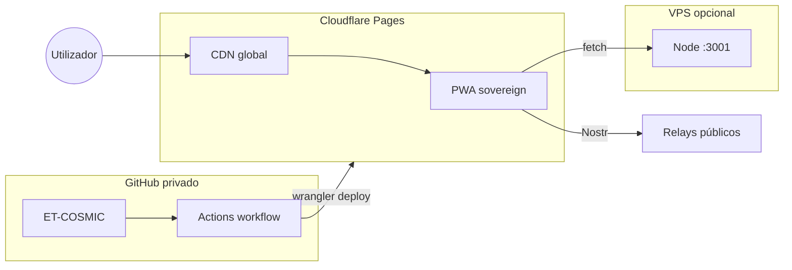

# Cloudflare Pages — hospedagem (alternativa)

> **Hospedagem principal:** [GITLAB-PAGES-HOSTING.md](./GITLAB-PAGES-HOSTING.md) (GitLab.com, repo privado OK).

---

## O que corre em Cloudflare Pages (100 % estático)

| Componente | Path |
|------------|------|
| PWA React (IMC v2 / sovereign) | `/` · `/mesh/liquidity` · `/lab/lusus` · … |
| WASM `void_core` | `/assets/*.wasm` |
| Mesh embed | `/void-mesh.js` |
| Tampermonkey | `/injectors/*.user.js` |
| SPA fallback | `public/_redirects` → `/* /index.html 200` |

APIs `/api/*` e LND ficam num **VPS** (`npm run server:sovereign`) — configure `VITE_PAGES_API_ORIGIN` no build.

---

## Setup rápido (Dashboard Cloudflare)

1. [Cloudflare Dashboard](https://dash.cloudflare.com/) → **Workers & Pages** → **Create** → **Pages** → **Connect to Git**
2. Repo: `bmcc-DEV/ET-COSMIC` (autorizar GitHub)
3. Configuração de build:

| Campo | Valor |
|-------|--------|
| Production branch | `main` |
| Build command | `npm run deploy:cloudflare` |
| Build output directory | `dist` |
| Node version | `22` (Environment variable `NODE_VERSION=22`) |

4. **Environment variables** (Production):
   - `VITE_PAGES_API_ORIGIN` = URL do VPS (opcional)
   - `NODE_VERSION` = `22`

5. Deploy → URL `https://<project>.pages.dev`

---

## Setup CI (GitHub Actions + Wrangler)

Alternativa ou complemento ao “Connect to Git” do Cloudflare — usa `.github/workflows/cloudflare-pages-deploy.yml`.

### 1. Token Cloudflare

Dashboard → My Profile → **API Tokens** → Create:

- Template: **Edit Cloudflare Workers** (inclui Pages)
- Ou permissões: Account → Cloudflare Pages → Edit

### 2. Secrets no GitHub

| Secret | Valor |
|--------|--------|
| `CLOUDFLARE_API_TOKEN` | token criado acima |
| `CLOUDFLARE_ACCOUNT_ID` | Dashboard → Workers & Pages → URL ou Overview |

### 3. Variables (opcional)

| Variable | Valor |
|----------|--------|
| `CLOUDFLARE_PAGES_PROJECT` | `et-cosmic` |
| `CLOUDFLARE_PAGES_URL` | `https://et-cosmic.pages.dev` |
| `PAGES_API_ORIGIN` | VPS API |

### 4. Criar projecto Pages (primeira vez)

```bash
npx wrangler pages project create et-cosmic --production-branch main
```

Ou deixa o workflow `wrangler pages deploy` criar no primeiro deploy.

### 5. Deploy

```bash
git push origin main
# ou manual:
gh workflow run cloudflare-pages-deploy.yml
```

---

## Build local

```bash
npm run deploy:cloudflare
npx serve dist -l 4173
# http://localhost:4173/mesh/liquidity
```

Deploy manual com Wrangler:

```bash
npm run deploy:cloudflare
npx wrangler pages deploy dist --project-name=et-cosmic
```

---

## Domínio custom

Cloudflare Pages → projecto → **Custom domains** → adicionar `eternent.example.com`.

Actualizar `CLOUDFLARE_PAGES_URL` na variable de build se usar `pages-config.json`.

---

## Arquitectura



---

## Referências

- `scripts/build-cloudflare-pages.mjs` · `scripts/build-static-pwa.mjs`
- `.github/workflows/cloudflare-pages-deploy.yml`
- `.env.cloudflare.example`
- [PROTOCOL-FIRST-MESH.md](./PROTOCOL-FIRST-MESH.md)
