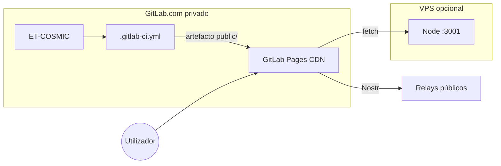

# GitLab Pages — hospedagem do ecossistema (repo privado OK)

> **Decisão (2026-05):** frontend ET-COSMIC / ETERNET em **GitLab.com Pages** — repo **privado** incluído no free tier.  
> URL típica: **https://\<project\>-\<id\>.gitlab.io/** (domínio único, base `/`) ou **https://\<namespace\>.gitlab.io/\<project\>/**

Alternativas: [CLOUDFLARE-PAGES-HOSTING.md](./CLOUDFLARE-PAGES-HOSTING.md) · [GITHUB-PAGES-HOSTING.md](./GITHUB-PAGES-HOSTING.md)

---

## O que corre em GitLab Pages (100 % estático)

| Componente | Path |
|------------|------|
| **Shell produção** (`index.pages.html` → `ProductionApp`) | `/<project>/` |
| SPA fallback | `404.html` (= cópia de `index.html`) — **sem** `_redirects` (evita MIME `text/html` em `/assets/*`) |
| Dev full IMC | `npm run dev` (local, não no CI Pages) |

APIs `/api/*` e LND → **VPS** (`npm run server:sovereign`) via `VITE_PAGES_API_ORIGIN` no CI.

---

## 1. Criar projecto no GitLab

1. [gitlab.com](https://gitlab.com) → **New project** → **Create blank project**
2. Nome: `ET-COSMIC` (privado)
3. Adicionar remote e push:

```bash
git remote add gitlab git@gitlab.com:<namespace>/ET-COSMIC.git
# ou HTTPS: https://gitlab.com/<namespace>/ET-COSMIC.git
git push -u gitlab main
```

Podes manter `origin` no GitHub como mirror secundário.

---

## 2. Activar GitLab Pages

1. Projecto → **Deploy** → **Pages**
2. Após o primeiro pipeline verde em `main`, a URL aparece automaticamente
3. Formato: domínio único `https://<project>-<id>.gitlab.io/` **ou** group `https://<namespace>.gitlab.io/<project-name>/`

**Settings** → **General** → **Visibility** → Pages: **Everyone** (público na web, repo continua privado).

---

## 3. CI/CD (já no repo)

Ficheiro `.gitlab-ci.yml`:

| Passo | Acção |
|-------|--------|
| Setup | Node 22 + Rust + wasm-pack |
| Build | `npm run deploy:gitlab` |
| Publish | `dist/` → artefacto `public/` (job `pages`) |

### Variáveis CI (Settings → CI/CD → Variables)

| Variable | Valor | Protegida |
|----------|--------|-----------|
| `VITE_PAGES_API_ORIGIN` | `https://seu-vps.example.com` | opcional |
| `PAGES_API_ORIGIN` | igual (alias) | opcional |

No **VPS** (`npm run server:sovereign`): `LND_REQUEST_TIMEOUT_MS=5000`. Se LND estiver offline em staging, `LND_FALLBACK_SIM=1` (invoice simulada + crédito via webhook de teste). Produção com LND real: não definir `LND_FALLBACK_SIM` ou `=0`.

`VITE_PAGES_BASE` é derivado de **`CI_PAGES_URL`** no job `pages` (pathname vazio → `/`; com segmento → `/<segmento>/`). Não definir manualmente salvo override local.

---

## 4. Build local

```bash
# Domínio único (como et-cosmic-6f2463.gitlab.io):
CI_PAGES_URL=https://et-cosmic-6f2463.gitlab.io npm run deploy:gitlab
npx serve dist -l 4173
# http://localhost:4173/

# Group pages (namespace.gitlab.io/project/):
CI_PAGES_URL=https://bmcc-dev.gitlab.io/et-cosmic npm run deploy:gitlab
```

---

## 5. Domínio custom

Projecto → **Deploy** → **Pages** → **New Domain** → `eternent.example.com`  
DNS: CNAME para `<namespace>.gitlab.io`.

Actualizar `GITLAB_PAGES_URL` se usares `pages-config.json` custom.

---

## Arquitectura



---

## Referências

- `scripts/build-gitlab-pages.mjs` · `scripts/build-static-pwa.mjs`
- `.gitlab-ci.yml`
- `.env.gitlab.example`
- [PROTOCOL-FIRST-MESH.md](./PROTOCOL-FIRST-MESH.md)
