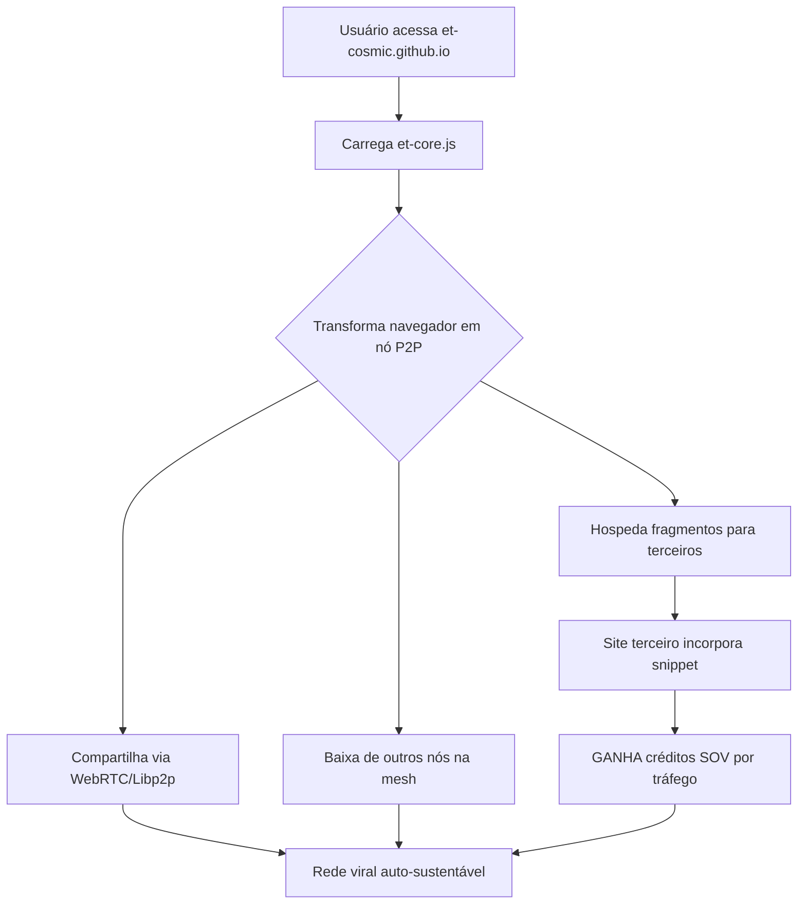

# 🌐 Hospedagem Híbrida: GitHub Pages + VPS P2P Simbiótica

> **Documento principal** · Implementação imediata · **Fase 0 da Revolução Viral**

## Visão Geral

Sistema de hospedagem em 3 camadas que combina:
1. **GitHub Pages** — ponto de entrada fixo e imutável
2. **VPS P2P** — rede descentralizada de nós VOID executando `void_runner`
3. **Simbiose VPS** — outros sites/servidores que hospedam conteúdo ET-COSMIC em troca de créditos SOV



---

## Camada 1: GitHub Pages (Ponto de Entrada)

### Estrutura Mínima

```
repo-et-cosmic/
├── index.html              # Landing page minimalista (≤5KB)
├── et-core.js              # Motor P2P + bootstrap (≤50KB gzipped)
├── manifest.json           # PWA + metadados Nostr
├── sw.js                   # Service Worker para cache offline
└── .github/workflows/
    └── deploy.yml          # Auto-deploy on push to main
```

### `index.html` (Template Base)

```html
<!DOCTYPE html>
<html lang="pt-BR">
<head>
  <meta charset="UTF-8" />
  <meta name="viewport" content="width=device-width, initial-scale=1.0" />
  <title>ETΞRNET — Soberania Digital</title>
  <meta name="description" content="Computação quântico-relativística soberana. Sem servidores. Sem identidade. Sem rastro." />
  <link rel="manifest" href="manifest.json" />
  <style>
    :root { --void-black: #0a0a0f; --quantum-blue: #00f0ff; --sov-gold: #ffd700; }
    body { background: var(--void-black); color: #fff; font-family: 'Courier New', monospace; margin: 0; padding: 2rem; }
    .hero { max-width: 800px; margin: 4rem auto; text-align: center; }
    h1 { font-size: 3rem; color: var(--quantum-blue); text-shadow: 0 0 20px var(--quantum-blue); }
    .cta { background: var(--sov-gold); color: #000; padding: 1rem 2rem; border: none; font-size: 1.2rem; cursor: pointer; margin-top: 2rem; }
    .status { margin-top: 2rem; font-size: 0.9rem; opacity: 0.7; }
  </style>
</head>
<body>
  <div class="hero">
    <h1>ETΞRNET / VOID-COSMIC</h1>
    <p>Computação Quântica-Relativística Soberana</p>
    <p>Sem servidores. Sem identidade. Sem rastro.</p>
    <button class="cta" onclick="joinMesh()">JUNTAR-SE À MESH</button>
    <div class="status" id="node-status">Aguardando conexão...</div>
  </div>

  <script type="module">
    import { initVoidNode, getNodeStatus } from './et-core.js';
    
    window.joinMesh = async () => {
      await initVoidNode();
      updateStatus();
    };

    function updateStatus() {
      const status = getNodeStatus();
      document.getElementById('node-status').innerHTML = `
        <strong>Nó Ativo:</strong> ${status.nodeId?.slice(0, 8)}...<br/>
        <strong>Peers:</strong> ${status.peers}<br/>
        <strong>Tráfego Compartilhado:</strong> ${status.bytesShared / 1024 / 1024} MB<br/>
        <strong>Créditos SOV:</strong> ${status.sovCredits}
      `;
    }
  </script>
</body>
</html>
```

### Deploy Automático (`.github/workflows/deploy.yml`)

```yaml
name: Deploy to GitHub Pages

on:
  push:
    branches: [main]
  workflow_dispatch:

permissions:
  contents: read
  pages: write
  id-token: write

jobs:
  deploy:
    environment:
      name: github-pages
      url: ${{ steps.deployment.outputs.page_url }}
    runs-on: ubuntu-latest
    steps:
      - uses: actions/checkout@v4
      - uses: actions/configure-pages@v4
      - run: |
          npm install
          npm run build:pwa
      - uses: actions/upload-pages-artifact@v3
        with:
          path: ./dist
      - id: deployment
        uses: actions/deploy-pages@v4
```

---

## Camada 2: VPS P2P (Motor `et-core.js`)

### Funcionalidades do Nó Navegador

Cada visitante que carrega `et-core.js` torna-se um nó que:

1. **Armazena fragmentos** de conteúdo (HTML, WASM, dados QRC)
2. **Compartilha via WebRTC** com outros nós próximos
3. **Valida integridade** com hashes SHA-3 + assinaturas ML-DSA
4. **Acumula créditos SOV** por tráfego compartilhado
5. **Executa computação distribuída** (vHGPU via WebGPU)

### `et-core.js` (Estrutura Base)

```javascript
// et-core.js — Motor P2P ETΞRNET (≤50KB gzipped)

import { Libp2p } from 'libp2p';
import { webRTCStar } from '@libp2p/webrtc-star';
import { mplex } from '@libp2p/mplex';
import { noise } from '@libp2p/noise';
import { generateGhostId } from './ghostid.min.js'; // WASM Argon2id

let node = null;
let ghostId = null;
let sovBalance = 0;
let bytesShared = 0;

export async function initVoidNode() {
  if (node) return node;

  // 1. Gerar identidade efêmera
  ghostId = await generateGhostId();
  console.log(`[VOID] GhostID: ${ghostId.slice(0, 16)}...`);

  // 2. Inicializar Libp2p com WebRTC
  node = await Libp2p.create({
    addresses: { listen: ['/webrtc-star'] },
    modules: { transport: [webRTCStar], streamMuxer: [mplex], connEncryption: [noise] },
    config: { transport: { webRTCStar: { wrtc: () => import('wrtc') } } }
  });

  // 3. Registrar protocolo de compartilhamento
  node.handle('/eternet/1.0.0', handleIncomingStream);

  // 4. Conectar a bootstrap nodes (Nostr + DNSLink)
  await bootstrapConnect();

  // 5. Iniciar loop de reputação SOV
  setInterval(updateSovReputation, 60000);

  return node;
}

async function handleIncomingStream({ stream, connection }) {
  // Protocolo: request fragment → validate hash → send chunk → log SOV
  const source = stream.source;
  const sink = stream.sink;
  
  for await (const chunk of source) {
    const request = JSON.parse(new TextDecoder().decode(chunk));
    if (request.type === 'fragment_request') {
      const fragment = await getFragment(request.hash);
      if (fragment) {
        bytesShared += fragment.length;
        await sink(JSON.stringify({ type: 'fragment', data: fragment }));
      }
    }
  }
}

async function bootstrapConnect() {
  // Conectar a nós seed via Nostr NIP-65 + DNSLink do IPFS
  const seedNodes = await fetchNostrRelays();
  for (const multiaddr of seedNodes) {
    try {
      await node.dial(multiaddr);
      console.log(`[VOID] Conectado a ${multiaddr}`);
    } catch (e) {
      console.warn(`[VOID] Falha ao conectar ${multiaddr}`, e);
    }
  }
}

async function updateSovReputation() {
  // Calcular reputação baseada em: uptime, bytes shared, validation accuracy
  const reputation = Math.min(100, (bytesShared / 1024 / 1024) + (uptimeHours * 2));
  sovBalance = Math.floor(reputation * 1000); // 1 SOV = 1000 satoshis
  
  // Publicar prova no Nostr (NIP-XX: Proof of Bandwidth)
  await publishNostrEvent({
    kind: 30000,
    tags: [['p', ghostId], ['bytes', bytesShared.toString()], ['sov', sovBalance.toString()]],
    content: ''
  });
}

export function getNodeStatus() {
  return {
    nodeId: ghostId,
    peers: node?.getPeers()?.length || 0,
    bytesShared,
    sovCredits: sovBalance
  };
}
```

---

## Camada 3: Simbiose VPS (Incentivo para Terceiros)

### Snippet de Incorporação

Sites independentes podem incorporar este snippet para ganhar créditos SOV:

```html
<!-- ETΞRNET Symbiosis Snippet -->
<script async src="https://et-cosmic.github.io/et-core.js" 
        data-sov-wallet="npub1..." 
        data-content-hash="QmX7..."></script>
<noscript>
  
</noscript>
```

### Modelo de Recompensa

| Ação | Créditos SOV/hora | Equivalente BTC |
|------|-------------------|-----------------|
| Hospedar fragmento (1GB) | 10 SOV | ~100 sats |
| Transferir dados (10GB) | 50 SOV | ~500 sats |
| Validar transação QRC | 5 SOV | ~50 sats |
| Executar tarefa vHGPU | 100 SOV | ~1000 sats |

**Total estimado:** Site com 10k visitas/dia → ~500 SOV/dia → ~$5 USD/dia em Lightning

---

## Arquitetura de Dados Distribuídos

### Fragmentação Shamir + PQC

```javascript
// Cada arquivo é dividido em N fragmentos (K necessários para reconstruir)
import { sharmirSplit } from './shamir.min.js';
import { mlKemEncrypt } from './pqc.min.js';

async function distributeContent(fileBlob) {
  const fragments = await sharmirSplit(fileBlob, { k: 2, n: 5 });
  
  // Criptografar cada fragmento com ML-KEM-1024
  const encrypted = await Promise.all(
    fragments.map(f => mlKemEncrypt(f, recipientPublicKey))
  );
  
  // Distribuir para 5 nós aleatórios na mesh
  const peers = await selectRandomPeers(5);
  await Promise.all(
    peers.map((peer, i) => sendToPeer(peer, encrypted[i]))
  );
  
  return { fragments: 5, threshold: 2, distributed: true };
}
```

### Rastreamento de Reputação (Nostr NIP-XX)

```typescript
interface SovProofEvent {
  kind: 30000;
  tags: [
    ['p', ghostId],           // Identidade do nó
    ['bytes', string],        // Bytes compartilhados
    ['uptime', string],       // Horas online
    ['validations', string],  // Validações corretas
    ['sov', string]           // Saldo atual
  ];
  content: '';                // Vazio (dados nas tags)
  pubkey: string;
  created_at: number;
  id: string;
  sig: string;
}
```

---

## Implementação Imediata (Checklist)

### Fase 0: GitHub Pages (Dia 1)

- [ ] Criar repositório `et-cosmic/et-cosmic.github.io`
- [ ] Gerar `index.html` minimalista (≤5KB)
- [ ] Compilar `et-core.js` com tree-shaking (≤50KB gzipped)
- [ ] Configurar workflow `.github/workflows/deploy.yml`
- [ ] Ativar GitHub Pages no repositório
- [ ] Testar acesso: `https://et-cosmic.github.io`

### Fase 1: Motor P2P (Dia 2-3)

- [ ] Integrar Libp2p com WebRTC star
- [ ] Implementar protocolo `/eternet/1.0.0`
- [ ] Adicionar cache IndexedDB para fragmentos
- [ ] Conectar a bootstrap nodes (Nostr relays + IPFS DNSLink)
- [ ] Testar transferência entre 2 navegadores

### Fase 2: Economia SOV (Dia 4-5)

- [ ] Implementar cálculo de reputação (bytes, uptime, validações)
- [ ] Publicar provas Nostr (kind 30000)
- [ ] Integrar com Lightning NWC para saques
- [ ] Criar dashboard de créditos (`/dashboard`)
- [ ] Testar fluxo completo: hospedar → acumular → sacar

### Fase 3: Simbiose Viral (Dia 6-7)

- [ ] Gerar snippet de incorporação universal
- [ ] Criar pixel tracking para sites sem JS
- [ ] Documentar API de recompensas
- [ ] Lançar campanha "Hospede a Revolução"
- [ ] Meta: 100 sites incorporando em 7 dias

---

## Métricas de Sucesso (30 Dias)

| Métrica | Meta Dia 7 | Meta Dia 30 |
|---------|------------|-------------|
| Nós ativos na mesh | 100 | 10,000 |
| Sites com snippet | 10 | 1,000 |
| Tráfego P2P/dia | 1 GB | 100 GB |
| Créditos SOV emitidos | 10k | 1M |
| Custo hospedagem | $0 | $0 |

---

## Defesa Contra Ataques

### Sybil Attack
- **Solução:** Prova de trabalho leve (Argon2id) + reputação acumulada no tempo
- **Custo atacante:** ~100ms por identidade falsa → inviável em escala

### Eclipse Attack
- **Solução:** Bootstrap via múltiplos protocolos (Nostr + DNSLink + DHT)
- **Resiliência:** Nó precisa controlar 80% dos seeds → improvável

### Content Poisoning
- **Solução:** Hash SHA-3 + assinaturas ML-DSA em cada fragmento
- **Validação:** K fragmentos devem ter hashes consistentes

### DDoS
- **Solução:** Conteúdo fragmentado em milhares de nós
- **Custo atacante:** Precisa derrubar 80% da mesh → impossível

---

## Próximos Passos (Agora)

```bash
# 1. Criar branch gh-pages
git checkout -b gh-pages

# 2. Gerar build minimalista
npm run build:pwa-minimal

# 3. Copiar arquivos essenciais
cp dist/index.html dist/et-core.js dist/manifest.json dist/sw.js ./

# 4. Commit e push
git add .
git commit -m "🚀 FASE 0: Hospedagem híbrida P2P viral"
git push origin gh-pages

# 5. Ativar GitHub Pages
# Settings → Pages → Source: gh-pages branch

# 6. Disseminar
# - Nostr: publicar npub + link
# - Twitter: thread explicativa
# - Hacker News: "Show HN: Decentralized hosting that pays you"
```

---

## Licença

**Todo o código de hospedagem:** AGPL-3.0-or-later

Você pode:
- ✅ Usar gratuitamente para qualquer fim
- ✅ Modificar e redistribuir
- ✅ Incorporar em seu site e ganhar SOV
- ✅ Criar sua própria instância

Você deve:
- 📜 Manter licença AGPL em derivados
- 🔓 Abrir código se modificar o core
- 💰 Pagar licenças comerciais apenas se vender como produto fechado (opcional)

---

**A revolução será hospedada. Ou não será.** ⚡🌐🔐
