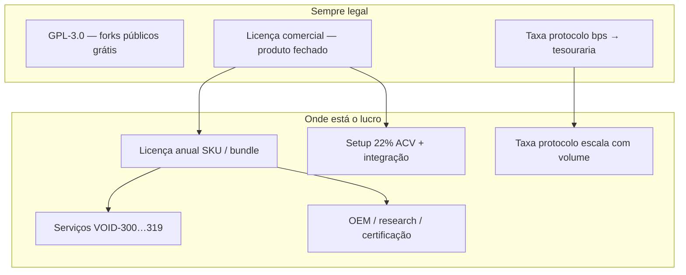

> **Documento secundário** · Apoio a [VOID-QRC — Plano Principal](./obsidian/VOID-QRC-PLANO-INDUSTRIA.md) · **Fase 4** — monetização

# Playbook de monetização — Protocol-First (evoluído)

> **Modelo activo:** [PROTOCOL-FIRST-MESH.md](./PROTOCOL-FIRST-MESH.md) — DAT, liquidity pools, tiers $SOV auto-executáveis. **Sem contratos jurídicos** como canal principal.  
> Legado EUR/contratos: `commercialPricing.ts` + [B2B-PRICING-TEMPLATE.md](./B2B-PRICING-TEMPLATE.md) (arquivo interno).

---

## 0. Protocol-First (canal principal)

| Mecanismo | Onde |
|-----------|------|
| Taxa protocolo bps | `protocolRoyalty.ts` · `/governance/sovereignty` |
| Liquidity pools AMM | `src/protocol/liquidity/` · `/mesh/liquidity` |
| Tiers Citizen→Sovereign | Debit $SOV/mês automático |
| VAS SKU VOID-305… | Pay-per-use µSOV |

---

## 1. Cinco camadas legado (referência interna EUR)

> Mantido para propostas enterprise tradicionais — **não** é o GTM principal.



| Camada | Mecanismo | Margem típica | Escala |
|--------|-----------|---------------|--------|
| **1. Licença B2B** | `VITE_B2B_SKUS` + contrato comercial | Alta | Por cliente / ano |
| **2. Setup** | 22% ACV ano 1 (implementação, MDM, compose) | Muito alta | One-shot |
| **3. Taxa protocolo** | `VITE_PROTOCOL_ROYALTY_BPS` + mínimo anual | Média-alta | Com volume financeiro |
| **4. Serviços** | Build white-label, auditoria PMU, archive | Alta | Por projeto |
| **5. Premium** | OEM, arquivo teoria, FULL-ENTERPRISE | Muito alta | Poucos clientes, ticket alto |

**Regra de ouro:** o repositório **nunca** fecha. Quem paga compra **direito de uso fechado** + **SLA** + **isenção de copyleft nos artefactos contratados** — não o monorepo.

---

## 2. Lista de preços agressiva (EUR, interno)

Valores em `src/b2b/commercialPricing.ts`. Resumo:

### Bundles (licença anual)

| Bundle | Lista / ano | Posicionamento |
|--------|-------------|----------------|
| SOVEREIGN-CITIZEN | €89 000 | PWA cidadão + Harmonia |
| MESSENGER-ENTERPRISE | €165 000 | Messenger + governança |
| FINANCE-NODE | €245 000 | Pagamentos + DEX + stablecoin |
| RESEARCH-INSTITUTE | €320 000 | Teoria + quantum lab |
| FULL-ENTERPRISE | €890 000 | 72 painéis UI |
| WHITE-LABEL-OEM | €1 200 000 | OEM + VOID-329 |
| VOID-CATALOG-FULL | €45 000 | Metadados 283 SKUs (sem UI total) |

### Taxa de protocolo (paralelo à licença)

| Perfil | bps | Mínimo anual EUR |
|--------|-----|------------------|
| Comunidade GPL | 10 (default código) | 0 |
| Growth comercial | 15 | €12 000 |
| Enterprise finance | 25–50 (contrato) | €36 000 |
| Sovereign / banco | 50 + auditoria | €120 000+ |

Cálculo: `receita = max(mínimo, volume_€ × bps / 10_000)`.  
Implementação: `src/protocol/sovereignty/protocolRoyalty.ts` — **sempre visível** no Payment Gateway e Nostr DEX.

### Setup (ano 1)

- **22% do ACV** — deploy Perfil A/B, `production:go`, integração LND/NWC, 1 workshop
- **VOID-305** build CI: €28 000 (one-shot)
- **VOID-306** APK MDM: €35 000
- **VOID-308** licença arquivo teoria: €85 000

---

## 3. Estratégia “lucro absurdo” (sem violar GPL)

### A. Âncora de preço (anchoring)

1. Apresentar sempre **FULL-ENTERPRISE €890k** primeiro.
2. Descer para **FINANCE-NODE** ou **SOVEREIGN-CITIZEN** como “desconto estratégico”.
3. Somar **taxa protocolo** com simulador — cliente com €50M/ano em pagamentos → **€125k–250k/ano** só em bps (25–50).

### B. Mínimos contratuais (cláusulas tipo)

- Compromisso mínimo **3 anos** em OEM e enterprise.
- **Mínimo anual protocolo** €36k mesmo com volume baixo no ano 1.
- **Renovação automática** + reajuste IPC + 8%.
- **Certificação anual** VOID-280–283 obrigatória (€45k–95k).

### C. Upsell por SKU (catálogo 283 IDs)

| Gatilho | Upsell |
|---------|--------|
| Usa Messenger | + FINANCE-NODE (+€156k lista) |
| Usa Payment | + taxa protocolo 25 bps |
| Usa Harmonia | + COMPUTE-WORKER + VOID-02 por nó |
| Pesquisa | VOID-09 arquivo teoria €120k/ano |
| White-label | VOID-305 + VOID-306 setup |

### D. Dupla cobrança legal no mesmo cliente

1. **Licença comercial** (fechado) — ACV alto.  
2. **Taxa protocolo** (GPL, transparente) — escala com GMV.  

Forks públicos continuam grátis → marketing e adoção. Empresas com app fechado **não têm alternativa** senão contrato (COMMERCIAL-LICENSE.md).

### E. Perfil de cliente ideal (ICP)

| ICP | Bundle | Receita ano 1 indicativa |
|-----|--------|---------------------------|
| Fintech / exchange | FINANCE-NODE + bps 25 | €400k–€1.2M |
| Governança / DAO | AMP-GOVERNANCE + FULL | €500k–€1.5M |
| Soberano nacional / telco | WHITE-LABEL-OEM | €1.5M–€4M (3 anos) |
| Laboratório | RESEARCH-INSTITUTE | €320k + arquivo |
| PME messenger | SOVEREIGN-CITIZEN | €89k + setup €20k |

---

## 4. VOID-00 — anti-clonagem WASM

Handshake ML-DSA-87 + `device_id` antes de `derive_ghost_id`. Ver [VOID-00-LICENSE-HANDSHAKE.md](./VOID-00-LICENSE-HANDSHAKE.md).

```bash
npm run void:license:gen-keys
npm run void:license:issue -- --entropy-hex <hex> --sku FINANCE-NODE
```

---

## 5. Ferramentas no repo

```bash
# Simular proposta
npm run b2b:revenue -- SOVEREIGN-CITIZEN
npm run b2b:revenue -- FULL-ENTERPRISE --volume-eur=50000000 --bps=25 --tier=sovereign

# Listar SKUs do deal
npm run b2b:list -- FINANCE-NODE

# Proposta comercial
cp docs/B2B-PRICING-TEMPLATE.md propostas/cliente-x.md
```

---

## 6. O que **não** fazer (viola licença)

| Proibido | Porquê |
|----------|--------|
| Fechar o GitHub oficial | Viola compromisso DUAL-LICENSE § Compromisso |
| Taxa escondida sem UI | Viola transparência NOTICE / sovereignty |
| Remover créditos GPL | Viola GPL §4 e NOTICE |
| Cobrar pela cópia do fork público | GPL permite redistribuição gratuita |
| Relicenciar monorepo só proprietário | Proibido explicitamente |

---

## 7. Ativação técnica (produção)

```bash
# .env.sovereign / .env.production
VITE_ETRNET_TREASURY_NPUB=npub1...          # destino taxas
VITE_PROTOCOL_ROYALTY_BPS=10               # comunidade; enterprise: contrato 25–50
VITE_REQUIRE_ATTRIBUTION=true
```

Painel: `/governance/sovereignty` (VOID-96).  
Pagamentos: taxa visível em `PaymentGatewayPanel` / Nostr DEX.

---

## 8. Projeção ilustrativa (3 clientes enterprise)

| Cliente | Licença | Protocolo (€50M GMV, 25 bps) | Setup 22% | Ano 1 |
|---------|---------|------------------------------|-----------|-------|
| A — Fintech | €245k | €125k | €81k | **€451k** |
| B — OEM | €1.2M | €250k | €319k | **€1.77M** |
| C — Sovereign | €89k | €36k mín. | €28k | **€153k** |

**Recorrente ano 2 (A+B):** €370k + €1.45M ≈ **€1.82M/ano** sem novo setup.

---

## 9. Referências

- [B2B-PRODUCT-LINES.md](./B2B-PRODUCT-LINES.md) — catálogo técnico
- [B2B-PRICING-TEMPLATE.md](./B2B-PRICING-TEMPLATE.md) — folha de proposta
- [PRODUCTION-READY.md](./PRODUCTION-READY.md) — deploy
- `src/b2b/commercialPricing.ts` — números canónicos
- `scripts/revenue-calculator.mjs` — simulador CLI

*Valores são lista interna; ajustar por mercado e advogado antes de assinar contrato.*
