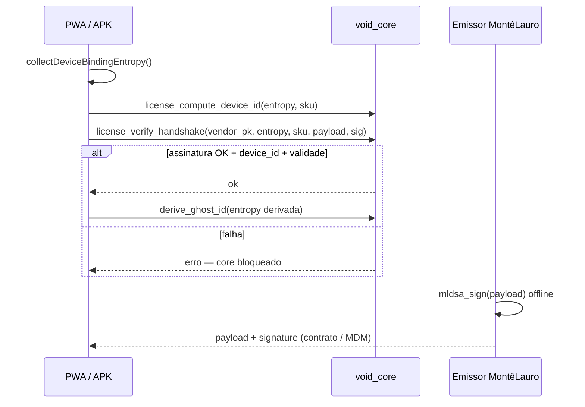

> **Documento secundário** · Apoio a [VOID-QRC — Plano Principal](./obsidian/VOID-QRC-PLANO-INDUSTRIA.md) · **Fase 4** — handshake VOID-00

# VOID-00 — Handshake de licença (hardware binding)

> **Objetivo:** mesmo que alguém copie o WASM, o motor só aceita derivação de identidade (`derive_ghost_id`) após validar um token **ML-DSA-87** assinado pelo titular e **amarrado ao dispositivo** (fingerprint + SKU).

## Fluxo



## Formato do payload (121 bytes)

| Campo | Tamanho |
|-------|---------|
| Magic `VOID00LC` | 8 |
| Versão | 1 |
| `device_id` (SHA3 entropia+SKU) | 32 |
| `sku_hash` | 32 |
| `license_id` | 16 |
| `not_before` / `not_after` | 8 + 8 |
| `nonce` | 16 |

Assinatura: **ML-DSA-87** (4627 bytes) sobre o payload bruto.

## Código

| Peça | Ficheiro |
|------|----------|
| Verificação WASM | `void_core/src/license.rs` |
| Gate TS | `src/crypto/voidLicense.ts` |
| Integração GhostID | `src/crypto/ghostid.ts` (antes de `derive_ghost_id`) |
| Emissor CLI | `scripts/issue-void-license.mjs` |

## Ativação (build comercial)

```bash
# 1. Gerar par do titular (uma vez, máquina emissor)
node scripts/issue-void-license.mjs --gen-vendor-keys
# → VOID_LICENSE_SIGNING_SEED_HEX + VOID_LICENSE_VENDOR_PK_HEX

# 2. No cliente: obter entropia (Android VoidAnimus ou fallback web)
#    Registar device_id antes de emitir licença

# 3. Emitir licença
npm run build:wasm
VOID_LICENSE_SIGNING_SEED_HEX=... VOID_LICENSE_VENDOR_PK_HEX=... \
  node scripts/issue-void-license.mjs --entropy-hex <hex> --sku FINANCE-NODE

# 4. Build PWA com token
VITE_VOID_LICENSE_ENFORCE=true \
VITE_VOID_LICENSE_VENDOR_PK=<2592 bytes hex> \
VITE_VOID_LICENSE_PAYLOAD_HEX=... \
VITE_VOID_LICENSE_SIGNATURE_HEX=... \
VITE_VOID_LICENSE_SKU=FINANCE-NODE \
npm run build:b2b -- FINANCE-NODE
```

## Modo comunidade (GPL)

Sem `VITE_VOID_LICENSE_ENFORCE=true` o handshake **não bloqueia** — forks públicos continuam a funcionar.

## Limites honestos

- **Web:** fingerprint é mais fraco que Android `VoidAnimusPlugin.getDeviceEntropy()`.
- **GPL:** não impede engenharia reversa do WASM; aumenta custo de clonagem sem contrato.
- **Revogação:** nova emissão com `not_after` menor ou lista de revogação (fase 2 — relay/anchor).

## SKU B2B

Ligar a [B2B-PRODUCT-LINES.md](./B2B-PRODUCT-LINES.md) §27 e bundle `VITE_B2B_SKUS`.
