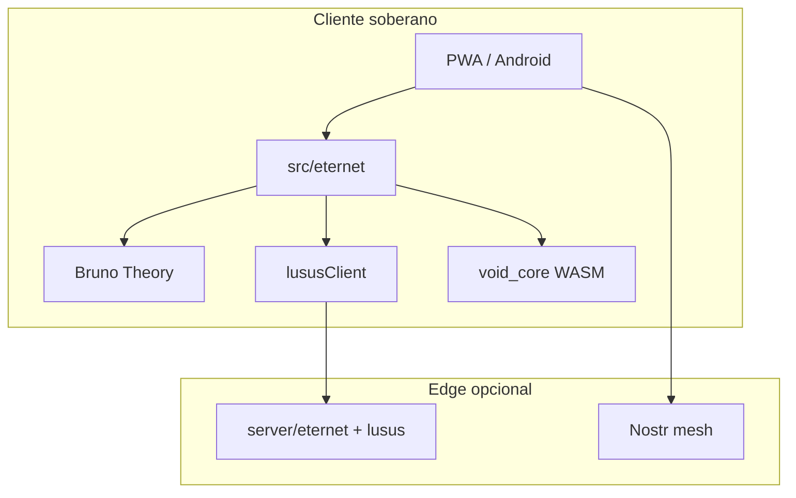

> **Documento secundário** · Apoio a [[VOID-QRC-PLANO-INDUSTRIA]] · **Transversal** — visão e contexto

# ETERNET — Visão

**ETERNET** = *Eternal Network*: comunicação e computação **sem depender de uma internet centralizada**, mas com **interoperabilidade** entre nós soberanos (Nostr, mesh, VOID-00, LSC, PMU).

## Princípios

1. **Descentralização real** — estado e provas no cliente + âncoras opcionais on-chain; sem API única obrigatória.
2. **Honestidade técnica** — não vender simulação tensorial (`quimb`) como “computação quântica real”.
3. **Núcleo Bruno + LUSUS** — entropia e otimização via **teoria proprietária** (FURC→HMCO→DTU→PDC→Colapso→RCP) e **fenómenos clássicos na fronteira** (LUSUS), não emulação de qubits.
4. **Código aberto soberano** — **AGPL-3.0-or-later** (VOID Sovereign Stack); receita via B2B, SLA e SKUs.
5. **MontêLauro Foundation** — taxa transparente na UI; governança documentada no whitepaper.

## VOID Sovereign Stack

Três destruições, uma rede, um substrato — ver [[VOID-SOVEREIGN-STACK]]:

- **VOID-BRIDGE** — QUBO/Ising clássico (sem fila quantum)
- **VOID-PCI** — PEFB, detecção MITM sem fóton
- **VOID-MESH** — Silent hosting VOID-700 + $SOV

Hub UI: `/compute/void-stack` · API: `POST /api/void`

## O que NÃO é ETERNET

- Não é “blockchain que substitui a Internet”.
- Não é QKD comercial sem laboratório.
- Não é violar Bell de verdade — LUSUS **simula impressão** com caos sincronizado (ver [[LUSUS-7-FALHAS]]).

## North Star (12 meses)

## Ligação ao ET-COSMIC

O monorepo **já contém** as peças; a unificação é **organizacional e de API**, não um rewrite:

| Peça | Caminho |
|------|---------|
| Cripto PQC | `void_core/` |
| Teoria | `src/theory/` |
| LUSUS | `server/lusus/` |
| Entropia unificada | `src/eternet/entropy.ts` |
| VOID Sovereign Stack | `server/void/`, `src/void/` |
| Compute mesh (legado imc) | `server/imc/` |

Ver [[PLANO-UNIFICACAO]].
