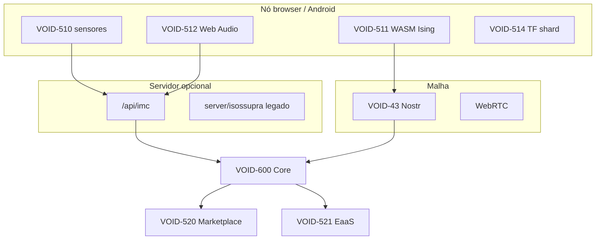

> **Documento secundário** · Apoio a [[VOID-QRC-PLANO-INDUSTRIA]] · **Fase 1–2** — malha IMC + API

# IMC — Isossupramulated Mesh Computer

## API

| Método | Path |
|--------|------|
| GET | `/api/imc/health` |
| GET | `/api/imc/status` |
| POST | `/api/imc/entropy/mesh` |
| POST | `/api/imc/ising/submit` |
| POST | `/api/imc/acoustic/derive` |
| POST | `/api/imc/marketplace/job` |
| POST | `/api/imc/entropy/service` |

## Cliente

`src/imc/` — `collectSensorEntropy()`, `measureRoomImpulse()`, `imcClient.ts`

## Painel

`/compute/imc` — `IMCCorePanel.tsx`
