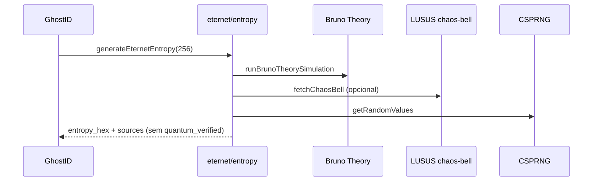

> **Documento secundário** · Apoio a [[VOID-QRC-PLANO-INDUSTRIA]] · **Fase 2–3** — mapa arquitectural

# Stack ETERNET — mapa de pastas

```
ET-COSMIC/
├── src/eternet/          ← fachada ETERNET (entropia)
├── src/isossupra/        ← cliente VOID-500–600
├── src/theory/           ← Bruno Theory (FURC…RCP)
├── src/lib/lususClient.ts
├── server/eternet/       ← /api/eternet
├── server/isossupra/     ← /api/isossupra (VOID-500–600)
├── server/lusus/         ← LUSUS (base dos motores)
├── void_core/            ← PQC WASM
├── server/aqre/          ← AQRE / spin / causal (legado pesquisa → core/)
└── docs/obsidian/        ← vault · principal: VOID-QRC-PLANO-INDUSTRIA
```

## Fluxo de entropia (Fase 1)



## Variáveis de ambiente

| Variável | Valores | Efeito |
|----------|---------|--------|
| `VITE_ETERNET_ENGINE` | `hybrid` (default), `bruno`, `lusus`, `legacy` | Motor de entropia no cliente |
| `VITE_LUSUS_API_URL` | `/api/lusus` | Base LUSUS |
| `VITE_VOID_LICENSE_ENFORCE` | `true` | Gate VOID-00 |

## Endpoints

| Método | Path | Descrição |
|--------|------|-----------|
| GET | `/api/eternet/health` | Status unificado |
| POST | `/api/eternet/entropy` | Entropia servidor (LUSUS + OS RNG) |
| GET | `/api/lusus/*` | Módulos LUSUS |
