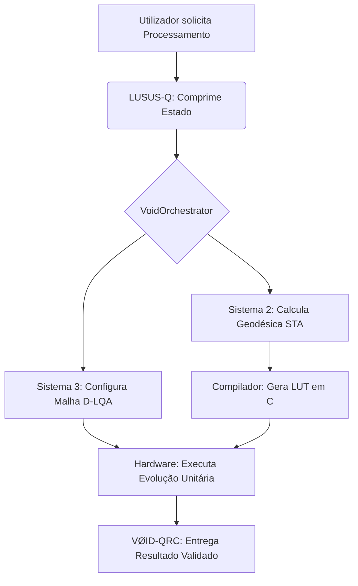

---
aliases:
  - Home
  - Início
  - Plano Principal
  - VOID-QRC
  - Mestre
cssclasses:
  - void-qrc-home
---

# VØID-QRC — Plano de Implementação (Alpha Industrial)

> **DOCUMENTO PRINCIPAL** do ecossistema ET-COSMIC / ETERNET.  
> Todas as notas em `docs/obsidian/`, ficheiros em `docs/` e `DOC/` são **secundárias** e servem este plano.  
> **Actualização:** 2026-05-20 · **Licença core:** AGPL-3.0-or-later  
> **Estado:** ✅ Alpha Industrial — checklist P0–P3 fechado · release `v2.0.0-sovereign`

---

## Como usar esta documentação

| Tipo | Onde | Papel |
|------|------|-------|
| **Principal** | **Esta nota** (`VOID-QRC-PLANO-INDUSTRIA`) | Roadmap industrial, 4 fases, workflow, gaps, stress |
| **Secundárias (Obsidian)** | [[README]] · notas com banner *Documento secundário* | Detalhe técnico, filosofia, SKUs, deploy |
| **Secundárias (repo)** | `docs/*.md`, `DOC/*.md` | Arquitectura, B2B, produção, Android |
| **Locais (gitignored)** | `docs/guides/`, `docs/specifications/`, `docs/archive/` | Runbooks e PDFs só no clone local |

**Entrada rápida fora do Obsidian:** [docs/VOID-QRC-MASTER-PLAN.md](../VOID-QRC-MASTER-PLAN.md)

---

## Visão — O que é VØID-QRC

**VØID-QRC** (Quantum-Relativistic Continuum) é a camada **industrial** que transforma simulação clássica honesta (LUSUS, AQRE, IMC) em produto alpha para fábricas e infraestrutura soberana.



| Sistema | Nome | Código hoje |
|---------|------|-------------|
| Compressão | **LUSUS-Q** | `server/lusus/`, `server/aqre/`, `src/qrc/` |
| Matéria condensada | **D-LQA** | `server/isossupra/`, IMC VOID-510–522 |
| Roteamento | **Motor QRC** | `VoidOrchestrator.ts`, `server/aqre/causal_tracker.js` |
| Hipervisor | **Continuum** | `void_runner/` (`lusus_tensor.rs`), `void_core/` |
| Soberania | **SOV + Mesh** | [[SOV-ECONOMY]], [[VOID-SOVEREIGN-STACK]] |

**Regra de honestidade:** [[DEPRECACAO-QUANTUM]] — **sabor «Quântico»** sobre motores clássicos; nunca hardware quântico real.

---

# FASE 1: Estabilização do Núcleo Físico (LUSUS-Q + D-LQA)

**Objectivo:** Garantir que a compressão de dados e os regimes de hardware sejam **determinísticos**.

## 1.1 Migração para o `core/` modular

| Acção | Origem | Destino | Estado |
|-------|--------|---------|--------|
| MERA / spin networks | `quantum/mera_compiler.py`, `quantum/spin_networks.py` | `core/tensor_networks/` | ✅ migrado |
| Hamiltonianos / Anderson | isossupra + AQRE | `core/hamiltonians/` | ✅ `anderson.py` + stress SKU-A/B |
| Adaptadores edge | — | `server/lusus/`, `server/aqre/` | ✅ operacional |

**Teste de Hermiticidade (gate obrigatório):**

- ✅ `core/tensor_networks/hermiticity.py` + `npm run core:test`
- ✅ Git hook pre-commit: `npm run hooks:install`
- Base Vitest: `src/qrc/tensorNetwork.test.ts` (norma unitária)

**Notas secundárias:** [[LUSUS-7-FALHAS]] · [[ISOSSUPRAMULACAO]] · [[SKUS-500-600]] · [server/aqre/README.md](../../server/aqre/README.md)

## 1.2 Validação dos regimes de matéria condensada

- Utilizar motor CQR/AQRE para **stress test da Jaula de Anderson**.
- **Métrica SKU:** desordem $W$ por processador alvo:

| SKU | Regime $W$ | Objectivo industrial |
|-----|------------|----------------------|
| **SKU-A** | Baixo $W$ · Anderson localizado | Latência baixa |
| **SKU-B** | Alto $W$ · transição | Retenção de memória |
| **VOID-511** | Ising / Max-Cut | Marketplace IMC |

**Aceite Fase 1:**

```bash
pytest core/                         # ou npm run core:test
npm run stress:qrc
npm run imc:preflight
curl -s http://localhost:3001/api/lusus/health
curl -s http://localhost:3001/api/aqre/health
```

---

# FASE 2: Roteamento Relativístico e Compilação (Motor QRC)

**Objectivo:** Sincronizar o cálculo das geodésicas com a execução em **tempo real**.

## 2.1 Integração STAUmpire ↔ VoidOrchestrator

| Item | Estado |
|------|--------|
| `planQrcRoute` + `planShardRoute()` em `VoidOrchestrator` | ✅ `src/qrc/qrcMotor.ts` |
| Espelho `eternet_ts/src/core/VoidOrchestrator.ts` | ✅ |
| LUT `trajectory_compiler.py` → TS | ✅ `npm run qrc:compile-lut` |
| Endpoints AQRE STA | ✅ `POST /api/aqre/sta/geodesic`, `/sta/route` |
| Proxy dev `/api/aqre` | ✅ Vite |

**Notas secundárias:** [[STACK-ETERNET]] · [[IMC-ARCHITECTURE]] · `src/lib/anacrocasticLimits.ts`

## 2.2 Monitorização Lieb-Robinson

- Em `server/aqre/causal_tracker.js`:
  - Velocidade limite $v_{LR} = 2J$.
  - Se `VoidOrchestrator` mover informação acima de $v_{LR}$ → **colapso para Jaula de Anderson** (estado de segurança).
  - HTTP **429** (LSC) como semântica de bloqueio.

| Item | Estado |
|------|--------|
| Métrica `liebRobinson` + `anderson_cage` | ✅ implementada |
| Colapso automático no Orchestrator | ✅ `COLLAPSE_EVENT` + `HCN_MESH` first |
| LUT `trajectory_compiler.py` | ✅ `trajectoryLut.generated.ts` |

**Aceite Fase 2:**

```bash
curl -X POST http://localhost:3001/api/aqre/run \
  -H 'Content-Type: application/json' \
  -d '{"task":"causal_tracker","params":{"size":16,"steps":40,"J":0.3}}'
npm run stress:eco -- --tier medium   # valida LR sob carga
```

---

# FASE 3: O Hipervisor e Segurança (VØID-QRC Continuum)

**Objectivo:** Unir software, física e hardware sob **criptografia pós-quântica**.

## 3.1 Execução de alta performance via Rust

| Tarefa | Componente | Estado |
|--------|------------|--------|
| Contração redes tensoriais LUSUS-Q | `void_runner/src/lusus_tensor.rs` | ✅ CLI + `/api/lusus/tensor/contract` |
| WASM / MapReduce | `void_runner/src/wasm_worker.rs` | ✅ |
| Bridge UI | `NativeBridge.ts` → `voidRunnerBridge.ts` | ✅ |

**Gargalo medido (stress heavy):** IMC/Isossupra ~120–200 ops/s — primeiro alvo Rust.

## 3.2 Blindagem PQC

| Camada | Estado |
|--------|--------|
| Geodésicas Sistema 2 (ML-DSA-87) | ✅ `qrcRoutePqc.ts` · selo `qrcSeal` por shard |
| Payload C3 (ML-KEM + Shamir) | ✅ `registerRecipientKey` + `recipientHandle` |
| WASM nativo `void_core/src/pqc.rs` | ✅ disponível · bridge browser opcional |

## 3.3 Soberania operacional (paralelo — operacional hoje)

| Item | Comando / nota secundária |
|------|---------------------------|
| Stack Docker | `npm run stack:up` |
| LND + NWC | `npm run finance:setup` · [[SOV-ECONOMY]] |
| Server | `npm run server:sovereign` |
| Pagamentos | `/finance/payment` · `npm run finance:payment-e2e` (HTTP) |
| Deploy Perfil A | [FILOSOFIA-DEPLOY.md](../../DOC/FILOSOFIA-DEPLOY.md) |
| Malha silenciosa | [[VOID-700-SILENT-MESH]] |
| Stack produto | [[VOID-SOVEREIGN-STACK]] |

**Notas secundárias:** [ARCH-EVOLUTION.md](../ARCH-EVOLUTION.md) · [DEPLOY-PRODUCTION.md](../../DOC/DEPLOY-PRODUCTION.md) · [PWA-ANDROID.md](../../DOC/PWA-ANDROID.md)

---

# FASE 4: Comercialização e Distribuição de SKUs

**Objectivo:** Transformar o código em **produtos vendáveis** (alpha industrial).

> Foco comunitário actual: **soberania financeira** (SOV/Lightning). Fase 4 = roadmap industrial; ver [[MODELO-NEGOCIO]] vs [[LICENCA-LIVRE]].

## 4.1 Gestão de licenças (handshake de negócios)

| Camada | Licença | Onde |
|--------|---------|------|
| **Core open-source** | AGPL-3.0 | `core/`, `eternet_ts/`, `src/eternet/` |
| **SKUs industriais** | Commercial | Drivers C, Thomas-Fermi premium (`thomas_fermi_solver.js`) |
| **Hardware** | VOID-00 | `void_core/src/license.rs` · [VOID-00-LICENSE-HANDSHAKE.md](../VOID-00-LICENSE-HANDSHAKE.md) |

**Notas secundárias:** [[LICENCA-LIVRE]] · [[WHITEPAPER-V2]]

## 4.2 Documentação de venda (B2B)

- Finalizar `docs/master-sku-list.tex` — regimes **Anderson · Peierls · SSH** como *Funcionalidade Hardware Premium*.
- Gerar PDF: `npm run docs:ready`

**Notas secundárias:** [B2B-PRODUCT-LINES.md](../B2B-PRODUCT-LINES.md) · [SKU-ECOSYSTEM-IMC.md](../SKU-ECOSYSTEM-IMC.md) · [[IMC-ADAPTACAO-MODULOS]] · [MONETIZATION-PLAYBOOK.md](../MONETIZATION-PLAYBOOK.md)

---

## Índice de documentos secundários

### Obsidian (`docs/obsidian/`)

| Nota | Fase | Conteúdo |
|------|------|----------|
| [[LUSUS-7-FALHAS]] | 1 | 7 falhas clássicas → motores LUSUS |
| [[ISOSSUPRAMULACAO]] | 1 | Filosofia iso + supra, VOID-600 |
| [[SKUS-500-600]] | 1–2 | Motores e rotas |
| [[IMC-ARCHITECTURE]] | 1–2 | Malha IMC + API |
| [[STACK-ETERNET]] | 2–3 | Mapa de pastas e camadas |
| [[VOID-SOVEREIGN-STACK]] | 3 | BRIDGE · PCI · MESH |
| [[VOID-700-SILENT-MESH]] | 3 | Propagação silenciosa |
| [[SOV-ECONOMY]] | 3 | Moeda $SOV |
| [[LICENCA-LIVRE]] | 4 | AGPL vs Big Tech |
| [[MODELO-NEGOCIO]] | 4 | Royalties + tesouraria |
| [[WHITEPAPER-V2]] | 4 | Whitepaper v2.0 |
| [[IMC-ADAPTACAO-MODULOS]] | 4 | SKU Cosmos IMC v2 |
| [[PLANO-UNIFICACAO]] | — | Plano ETERNET legado (paralelo) |
| [[DEPRECACAO-QUANTUM]] | — | Nomenclatura honesta (transversal) |
| [[PURGE-LEGADO]] | 1 | Purge IMC · `quantum/` descartado (ver archive) |
| [[EVOLUCAO-ECOSSISTEMA]] | — | Diagnóstico riscos |
| [[SKUS-RUMOS-JOBS]] | — | Backlog jobs críticos |
| [[INFRASTRUCTURE-MANIFEST]] | — | Build `VITE_IMC_V2=1` |
| [[ETERNET-VISAO]] | — | Visão descentralizada |

### Repositório `docs/`

| Ficheiro | Fase |
|----------|------|
| [ARCH-EVOLUTION.md](../ARCH-EVOLUTION.md) | 2–3 |
| [PRODUCTION-READY.md](../PRODUCTION-READY.md) | 4 |
| [SOVEREIGNTY-AND-ROYALTIES.md](../SOVEREIGNTY-AND-ROYALTIES.md) | 4 |
| [B2B-PRODUCT-LINES.md](../B2B-PRODUCT-LINES.md) | 4 |
| [B2B-PRICING-TEMPLATE.md](../B2B-PRICING-TEMPLATE.md) | 4 |
| [SKU-ECOSYSTEM-IMC.md](../SKU-ECOSYSTEM-IMC.md) | 4 |
| [VOID-00-LICENSE-HANDSHAKE.md](../VOID-00-LICENSE-HANDSHAKE.md) | 4 |
| [whitepaper-v2.0.md](../whitepaper-v2.0.md) | 4 |
| [master-sku-list.tex](../master-sku-list.tex) | 4 |

### Deploy `DOC/`

| Ficheiro | Fase |
|----------|------|
| [FILOSOFIA-DEPLOY.md](../../DOC/FILOSOFIA-DEPLOY.md) | 3 |
| [DEPLOY-PRODUCTION.md](../../DOC/DEPLOY-PRODUCTION.md) | 3–4 |
| [ANDROID-HARMONY.md](../../DOC/ANDROID-HARMONY.md) | 3 |
| [PWA-ANDROID.md](../../DOC/PWA-ANDROID.md) | 3 |
| [ANDROID-REMOTE.md](../../DOC/ANDROID-REMOTE.md) | 3 |

### Pastas locais (gitignored)

| Pasta | README |
|-------|--------|
| Runbooks | [guides/README.md](../guides/README.md) |
| PDFs técnicos | [specifications/README.md](../specifications/README.md) |
| Teoria Bruno | [archive/README.md](../archive/README.md) |

---

## Gap analysis (código vs plano)

| Item | Estado |
|------|--------|
| `core/tensor_networks/`, `core/hamiltonians/` | ✅ criado (alpha) |
| `quantum/*.py` → migrar | ✅ `core/` · legado descartado (histórico em git/archive) |
| Hermiticidade + git hook | ✅ `npm run core:test` · `npm run hooks:install` |
| Anderson stress SKU-A/B | ✅ `npm run anderson:stress` |
| VoidOrchestrator → geodésica sin² | ✅ `planQrcRoute` + `planShardRoute()` |
| `trajectory_compiler.py` LUTs | ✅ `npm run qrc:compile-lut` |
| Lieb-Robinson colapso auto | ✅ Orchestrator → `anderson_cage` + `HCN_MESH` |
| void_runner tensor contraction | ✅ `lusus_tensor.rs` + `/api/lusus/tensor/contract` |
| PQC geodésicas Sistema 2 | ✅ ML-DSA em cada rota |
| PQC payload C3 (destinatário) | ✅ via `recipientHandle` + `registerRecipientKey` |
| Verificação `qrcSeal` inbound | ✅ `verifyQrcRouteSeal` no Orchestrator |
| `license.rs` produção | ✅ community + `npm run build:sovereign` · comercial: `license:setup` |
| LND + NWC + SOV persist | ✅ |
| Tag `v2.0.0-sovereign` | ✅ `npm run release:sovereign` |

---

## Stress tests — até onde o ecossistema aguenta

```bash
npm run stress:eco              # medium ~4k ops
npm run stress:eco:heavy        # ~21k ops · veredito HEAVY_OK
npm run stress:eco:http         # server live
npm run stress:qrc              # Vitest tensores + motores
npm run stress:all
```

| Tier | Ops | Resultado típico |
|------|-----|------------------|
| smoke | ~400 | CI <1s |
| medium | ~4k | 0 falhas · LSC cε≈0.86 |
| heavy | ~21k | **HEAVY_OK** · gargalo IMC ~200 ops/s |
| extreme | ~100k+ | tecto absoluto |

**Limites:** AQRE spin ≤20 nós · LSC cε>0.86 → 429 · VOID-700 throttle · IMC Ising n≤64.

---

## Checklist executável

### P0 — Alpha
- [x] Migrar `spin_networks` + `mera_compiler` → `core/`
- [x] Hermiticidade + pre-commit hook (`npm run hooks:install`)
- [x] ~~Restaurar `quantum/`~~ descartado — `core/` + archive
- [x] Tag `v2.0.0-sovereign` (`npm run release:sovereign`)

### P1 — Motor QRC (Fase 2)
- [x] VoidOrchestrator → geodésica STA (`src/qrc/qrcMotor.ts`)
- [x] `trajectory_compiler` + LUTs (`npm run qrc:compile-lut`)
- [x] Wire LR → colapso Anderson no Orchestrator

### P2 — Continuum (Fase 3)
- [x] void_runner: contração LUSUS-Q
- [x] PQC geodésicas Sistema 2 (ML-DSA)
- [x] `/finance/payment` E2E fluxo (Vitest + `npm run finance:payment:full`)

### P3 — Industrial (Fase 4)
- [x] `master-sku-list.tex` regimes premium (Anderson · Peierls · SSH)
- [x] `license.rs` em produção (`npm run build:sovereign` · enforce via `license:setup`)

---

## Comandos

```bash
# Fase 3 soberania (hoje)
npm run stack:up && npm run finance:setup && npm run server:sovereign && npm run dev

# Qualidade
npm run validate && npm run core:test && npm run stress:all
npm run finance:payment:full
npm run license:setup license.json && npm run build:sovereign
npm run imc:preflight

# Tensor LUSUS-Q (Rust opcional)
cd void_runner && cargo build --release

# Fase 4 docs
npm run docs:ready
```

---

## Roadmap paralelo ETERNET

O plano [[PLANO-UNIFICACAO]] (Fases 0–4 ETERNET) corre **em paralelo** — não substitui este documento. Em conflito, **VØID-QRC prevalece** para decisões industriais.

| ETERNET | VOID-QRC | Estado |
|---------|----------|--------|
| Fase 0 honestidade | Pré-requisito | ✅ |
| Fase 1 entropia | Fase 1 LUSUS-Q | ✅ alpha (`core/` + stress) |
| Fase 2 UI `/lab/*` | Fase 2 QRC | ✅ motor + LUT + LR |
| Fase 3 mesh | Fase 3 Continuum | ✅ SOV · tensor · PQC · payment flow Vitest |
| Fase 4 B2B | Fase 4 SKUs | ✅ docs · `release:sovereign` |
