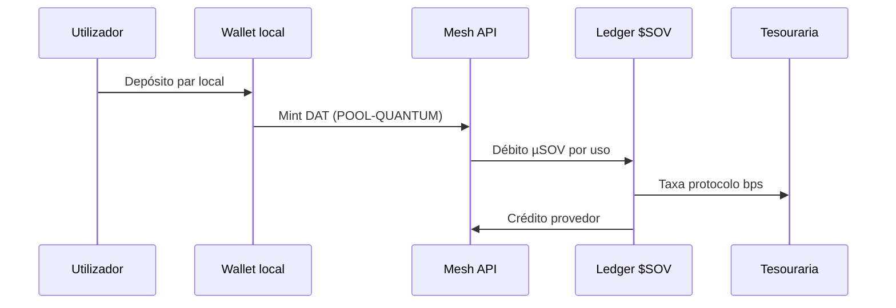

# Pagamentos locais pareados (Cliente)

> **Filosofia:** moeda regional descentralizada (Lightning / NWC / stablecoin local) **pareada** ao ledger $SOV interno — taxas automáticas, zero contrato.

## Fluxo



## Taxas (automáticas)

| Tipo | Valor típico | Destino |
|------|--------------|---------|
| Protocolo | 25 bps (config) | `VITE_ETRNET_TREASURY_NPUB` |
| POOL-QUANTUM | 4,5% | Pool + tesouraria |
| Outras pools | 1,2–3,2% | AMM |

## Pares locais (roadmap)

| Par | Uso |
|-----|-----|
| Lightning (regtest/mainnet) | Micro-pagamentos instantâneos |
| NWC / Alby Hub | Wallet soberano dev |
| Stablecoin regional | Enterprise local sem EUR |

**Implementação:** `src/mesh/liquidityMeshClient.ts` · `server/mesh/liquidity.js`

## Depósito pareado (implementado)

| Passo | API |
|-------|-----|
| 1. Intent | `POST /api/economy/deposit/paired/intent` |
| 2. Invoice | `POST /api/lightning/create` + `{ pairedDepositId, amountSat }` |
| 3. Crédito | webhook LND ou `POST /api/lightning/simulate-settle/:id` (dev) |
| UI | `/sabor-quantico#deposito-pareado` · `PairedDepositPanel.tsx` |

Câmbio: `SOV_SAT_RATE` (default 1000 sats = 1 $SOV). Persistência: `void_pool/paired-deposits.json`.

```bash
npm run cliente:lane-e2e   # VPS: timeout LND 5s + fallback sim se offline
```

**Produção VPS:** LND activo + webhook, ou `LND_FALLBACK_SIM=1` em staging.  
**Variáveis:** `LND_REQUEST_TIMEOUT_MS`, `SOV_SAT_RATE`, `SOV_DEPOSIT_DEMO` (staging).

## UI produção

- https://et-cosmic-6f2463.gitlab.io/sabor-quantico
- `#deposito-pareado` · `#builder-subscribe` · `#void-308`
- Calculadora reputação POOL-QUANTUM live

## Specs

- `specs/001-cliente-moeda-pareada-local/spec.md` (baseline)
- `specs/007-cliente-deposit-pareado/spec.md`
- `specs/006-cliente-builder-subscribe/spec.md`

## Ver também

- [[../MODELO-NEGOCIO]]
- [PROTOCOL-FIRST-MESH.md](../../PROTOCOL-FIRST-MESH.md)
